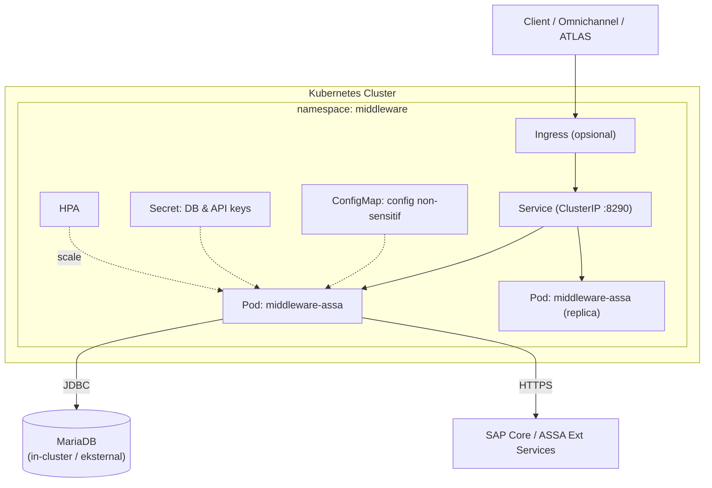

# Guide — Deploy ASSA Middleware ke Kubernetes
## WSO2 Micro Integrator — Docker Build → Registry → Kubernetes

> **Untuk**: Developer / DevOps (assignment task)
> **Tujuan**: Build image Docker middleware, push ke registry, lalu jalankan di Kubernetes lengkap dengan config, secret, probe, service, dan (opsional) ingress + autoscaling.
> **Basis**: `Dockerfile` root (base `wso2/wso2mi:4.6.0`), `deployment/deployment.toml`, health endpoint `/health` & `/health/ready`, port `8290/8253/9164`.

---

## Daftar Isi
1. [Ringkasan & Arsitektur Target](#1-ringkasan--arsitektur-target)
2. [Prasyarat](#2-prasyarat)
3. [Langkah 1 — Build Artefak & Image Docker](#3-langkah-1--build-artefak--image-docker)
4. [Langkah 2 — Push Image ke Registry](#4-langkah-2--push-image-ke-registry)
5. [Langkah 3 — Namespace, ConfigMap & Secret](#5-langkah-3--namespace-configmap--secret)
6. [Langkah 4 — Deployment](#6-langkah-4--deployment)
7. [Langkah 5 — Service](#7-langkah-5--service)
8. [Langkah 6 — Ingress (Opsional)](#8-langkah-6--ingress-opsional)
9. [Langkah 7 — HPA Autoscaling (Opsional)](#9-langkah-7--hpa-autoscaling-opsional)
10. [Langkah 8 — Deploy & Verifikasi](#10-langkah-8--deploy--verifikasi)
11. [Catatan Database (Penting)](#11-catatan-database-penting)
12. [Egress & Domain Backend](#12-egress--domain-backend)
13. [Troubleshooting](#13-troubleshooting)
14. [Checklist Acceptance](#14-checklist-acceptance)

---

## 1. Ringkasan & Arsitektur Target



Port kontainer:
| Port | Fungsi |
|---|---|
| `8290` | HTTP pass-through API (endpoint utama) |
| `8253` | HTTPS pass-through API |
| `9164` | Management HTTPS API |

Health endpoint (dari `HealthAPI.xml`, tanpa token):
- Liveness: `GET /health`
- Readiness: `GET /health/ready`

---

## 2. Prasyarat
- Docker terpasang; akses ke container registry (mis. ACR/ECR/GCR/Harbor/Docker Hub).
- `kubectl` terkonfigurasi ke cluster target.
- Maven (untuk build `.car`) — atau gunakan multi-stage build.
- MariaDB tersedia (in-cluster atau managed/eksternal) berisi skema `assa_middleware_db` (`scripts/db/init_mariadb_schema.sql`).
- (Opsional) Ingress controller (mis. NGINX) & metrics-server untuk HPA.

---

## 3. Langkah 1 — Build Artefak & Image Docker

### 3.1 Build `.car` dengan Maven
```powershell
mvn clean package
```
Menghasilkan `target/middleware-assa_1.0.0.car` dan driver di `deployment/libs/`.

### 3.2 Build image (pakai `Dockerfile` root yang sudah ada)
`Dockerfile` root sudah menyalin `.car`, driver JDBC, `deployment.toml`, dan `entrypoint.sh`.
```powershell
docker build -t middleware-assa:1.0.0 .
```

> **Rekomendasi untuk K8s (opsional, lebih reproducible)**: buat **multi-stage Dockerfile** agar build `.car` terjadi di dalam image (tidak bergantung Maven lokal). Simpan sebagai `Dockerfile.k8s`:
> ```dockerfile
> # ---- Stage 1: build .car ----
> FROM maven:3.9-eclipse-temurin-11 AS build
> WORKDIR /app
> COPY . .
> RUN mvn -q clean package -DskipTests
>
> # ---- Stage 2: runtime ----
> ARG BASE_IMAGE=wso2/wso2mi:4.6.0
> FROM ${BASE_IMAGE}
> USER root
> COPY --from=build /app/deployment/libs/*.jar ${WSO2_SERVER_HOME}/lib/
> COPY --from=build /app/target/*.car ${WSO2_SERVER_HOME}/repository/deployment/server/carbonapps/
> COPY deployment/deployment.toml ${WSO2_SERVER_HOME}/conf/deployment.toml
> COPY deployment/docker/entrypoint.sh /home/wso2carbon/entrypoint.sh
> RUN sed -i 's/\r$//' /home/wso2carbon/entrypoint.sh && chmod +x /home/wso2carbon/entrypoint.sh && \
>     chown -R wso2carbon:wso2 /home/wso2carbon/entrypoint.sh ${WSO2_SERVER_HOME}/lib/*.jar \
>     ${WSO2_SERVER_HOME}/repository/deployment/server/carbonapps/*.car ${WSO2_SERVER_HOME}/conf/deployment.toml
> USER wso2carbon
> EXPOSE 8290 8253 9164
> ENTRYPOINT ["/home/wso2carbon/entrypoint.sh"]
> ```
> Build: `docker build -f Dockerfile.k8s -t middleware-assa:1.0.0 .`

> **Catatan entrypoint & DB**: `entrypoint.sh` menjalankan TCP forwarder `127.0.0.1:3307 → ${DB_HOST}:${DB_PORT}`. Di K8s, set `DB_HOST` = service DB (mis. `mariadb.middleware.svc.cluster.local`) dan `DB_PORT` = `3306`. Lihat [Bagian 11](#11-catatan-database-penting).

---

## 4. Langkah 2 — Push Image ke Registry

Ganti `<REGISTRY>` sesuai milikmu (mis. `registryassa.azurecr.io`, `ghcr.io/assa`, dll).
```powershell
docker tag middleware-assa:1.0.0 <REGISTRY>/middleware-assa:1.0.0
docker login <REGISTRY>
docker push <REGISTRY>/middleware-assa:1.0.0
```

Bila registry privat, buat imagePullSecret:
```powershell
kubectl create secret docker-registry regcred `
  --docker-server=<REGISTRY> --docker-username=<USER> --docker-password=<PASS> `
  -n middleware
```

---

## 5. Langkah 3 — Namespace, ConfigMap & Secret

### 5.1 Namespace — `k8s/00-namespace.yaml`
```yaml
apiVersion: v1
kind: Namespace
metadata:
  name: middleware
```

### 5.2 ConfigMap (non-sensitif) — `k8s/10-configmap.yaml`
Nilai environment yang dibaca `ResolveBaseUrlSeq` & entrypoint. Rahasia TIDAK ditaruh di sini.
```yaml
apiVersion: v1
kind: ConfigMap
metadata:
  name: middleware-config
  namespace: middleware
data:
  DB_HOST: "mariadb.middleware.svc.cluster.local"
  DB_PORT: "3306"
  SAP_CORE_BASE_URL: "https://devsapcoreapi.assa.id"
  SAP_CORE_CUSTOMER_BASE_URL: "https://sapcoreapi.assa.id"
  ASSA_EXT_BASE_URL: "https://assa-ext-services.assa.id/qa"
  JAVA_OPTS: "-Xms512m -Xmx1024m"
```

### 5.3 Secret (sensitif) — `k8s/11-secret.yaml`
> **Jangan commit nilai asli.** Gunakan Sealed Secrets / External Secrets / Vault untuk produksi. Contoh di bawah untuk ilustrasi.
```yaml
apiVersion: v1
kind: Secret
metadata:
  name: middleware-secret
  namespace: middleware
type: Opaque
stringData:
  DB_USERNAME: "assa_user"
  DB_PASSWORD: "__CHANGE_ME__"
  ASSA_EXT_VEHICLE_APIKEY: "__CHANGE_ME__"
  ASSA_EXT_SR_APIKEY: "__CHANGE_ME__"
```

> **Best practice**: pindahkan `db.username`, `db.password`, dan seluruh API key/token dari `config.properties`/`deployment.toml` agar berasal dari env/Secret ini. Aktifkan WSO2 Secure Vault untuk kredensial yang tetap harus berada di file.

---

## 6. Langkah 4 — Deployment

`k8s/20-deployment.yaml`
```yaml
apiVersion: apps/v1
kind: Deployment
metadata:
  name: middleware-assa
  namespace: middleware
  labels:
    app: middleware-assa
spec:
  replicas: 2
  selector:
    matchLabels:
      app: middleware-assa
  template:
    metadata:
      labels:
        app: middleware-assa
    spec:
      # imagePullSecrets:
      #   - name: regcred
      containers:
        - name: middleware-assa
          image: <REGISTRY>/middleware-assa:1.0.0
          imagePullPolicy: IfNotPresent
          ports:
            - { name: http, containerPort: 8290 }
            - { name: https, containerPort: 8253 }
            - { name: mgmt, containerPort: 9164 }
          envFrom:
            - configMapRef: { name: middleware-config }
          env:
            - name: DB_USERNAME
              valueFrom: { secretKeyRef: { name: middleware-secret, key: DB_USERNAME } }
            - name: DB_PASSWORD
              valueFrom: { secretKeyRef: { name: middleware-secret, key: DB_PASSWORD } }
            - name: ASSA_EXT_VEHICLE_APIKEY
              valueFrom: { secretKeyRef: { name: middleware-secret, key: ASSA_EXT_VEHICLE_APIKEY } }
            - name: ASSA_EXT_SR_APIKEY
              valueFrom: { secretKeyRef: { name: middleware-secret, key: ASSA_EXT_SR_APIKEY } }
          readinessProbe:
            httpGet: { path: /health/ready, port: 8290 }
            initialDelaySeconds: 40
            periodSeconds: 10
            timeoutSeconds: 5
            failureThreshold: 6
          livenessProbe:
            httpGet: { path: /health, port: 8290 }
            initialDelaySeconds: 60
            periodSeconds: 15
            timeoutSeconds: 5
            failureThreshold: 3
          startupProbe:
            httpGet: { path: /health, port: 8290 }
            initialDelaySeconds: 30
            periodSeconds: 10
            failureThreshold: 30
          resources:
            requests: { cpu: "500m", memory: "768Mi" }
            limits:   { cpu: "1500m", memory: "1536Mi" }
          securityContext:
            runAsNonRoot: true
            allowPrivilegeEscalation: false
```

> **Probe**: WSO2 MI butuh waktu warm-up. `startupProbe` melindungi boot lambat; setelah lulus, liveness/readiness aktif. Sesuaikan delay bila cluster lebih lambat/cepat.

---

## 7. Langkah 5 — Service

`k8s/30-service.yaml`
```yaml
apiVersion: v1
kind: Service
metadata:
  name: middleware-assa
  namespace: middleware
  labels:
    app: middleware-assa
spec:
  type: ClusterIP
  selector:
    app: middleware-assa
  ports:
    - { name: http, port: 8290, targetPort: 8290 }
    - { name: https, port: 8253, targetPort: 8253 }
```

> Management port `9164` sengaja tidak diekspos ke Service publik (khusus internal/ops).

---

## 8. Langkah 6 — Ingress (Opsional)

`k8s/40-ingress.yaml` (contoh NGINX ingress)
```yaml
apiVersion: networking.k8s.io/v1
kind: Ingress
metadata:
  name: middleware-assa
  namespace: middleware
  annotations:
    nginx.ingress.kubernetes.io/ssl-redirect: "true"
spec:
  ingressClassName: nginx
  tls:
    - hosts: [ "middleware.assa.id" ]
      secretName: middleware-tls
  rules:
    - host: middleware.assa.id
      http:
        paths:
          - path: /
            pathType: Prefix
            backend:
              service:
                name: middleware-assa
                port: { number: 8290 }
```

---

## 9. Langkah 7 — HPA Autoscaling (Opsional)

`k8s/50-hpa.yaml` (butuh metrics-server)
```yaml
apiVersion: autoscaling/v2
kind: HorizontalPodAutoscaler
metadata:
  name: middleware-assa
  namespace: middleware
spec:
  scaleTargetRef:
    apiVersion: apps/v1
    kind: Deployment
    name: middleware-assa
  minReplicas: 2
  maxReplicas: 6
  metrics:
    - type: Resource
      resource:
        name: cpu
        target: { type: Utilization, averageUtilization: 70 }
```

---

## 10. Langkah 8 — Deploy & Verifikasi

```powershell
kubectl apply -f k8s/00-namespace.yaml
kubectl apply -f k8s/10-configmap.yaml
kubectl apply -f k8s/11-secret.yaml
kubectl apply -f k8s/20-deployment.yaml
kubectl apply -f k8s/30-service.yaml
kubectl apply -f k8s/40-ingress.yaml   # opsional
kubectl apply -f k8s/50-hpa.yaml       # opsional
```

Verifikasi:
```powershell
kubectl -n middleware get pods -w
kubectl -n middleware logs deploy/middleware-assa -f
kubectl -n middleware get svc,ingress,hpa
```

Uji health via port-forward:
```powershell
kubectl -n middleware port-forward svc/middleware-assa 8290:8290
# di terminal lain:
curl http://localhost:8290/health
curl http://localhost:8290/health/ready
```

---

## 11. Catatan Database (Penting)

Aplikasi & `deployment.toml` mengarah ke `jdbc:mariadb://localhost:3307/...`. Di image, `entrypoint.sh` menjalankan **TCP forwarder** `127.0.0.1:3307 → ${DB_HOST}:${DB_PORT}`. Jadi di K8s cukup set env:
- `DB_HOST` = alamat MariaDB (service in-cluster atau host managed DB).
- `DB_PORT` = `3306` (atau port DB sebenarnya).

Dua opsi DB:
1. **MariaDB in-cluster**: deploy MariaDB (StatefulSet + PVC) di namespace `middleware`, service `mariadb:3306`. Set `DB_HOST=mariadb.middleware.svc.cluster.local`.
2. **Managed/eksternal**: arahkan `DB_HOST` ke endpoint DB, buka firewall dari cluster.

> Pastikan skema sudah dibuat (`scripts/db/init_mariadb_schema.sql`) sebelum pod start. Untuk in-cluster, jalankan sebagai init Job atau initdb.
>
> **Alternatif tanpa forwarder**: bila lebih suka koneksi langsung, ubah `db.url` di `deployment.toml` ke host/port DB nyata dan hapus dependensi forwarder. Forwarder dipertahankan agar konfigurasi aplikasi tidak berubah antar-environment.

---

## 12. Egress & Domain Backend

Bagian ini menjawab: **apakah domain yang dikonsumsi middleware wajib public atau boleh private?**

### 12.1 Jawaban singkat
**Tidak wajib public — dan idealnya justru private.** Yang menentukan bukan label public/private, tapi apakah **pod middleware bisa me-resolve DNS dan membuka koneksi ke host tujuan**. Selama jalur jaringan (routing + firewall + DNS) tersedia, domain internal (private) lebih aman dan lebih disukai. Ini soal **egress/outbound**, terpisah dari Ingress (arah masuk) di [Bagian 8](#8-langkah-6--ingress-opsional).

### 12.2 Domain yang dikonsumsi middleware (outbound)
Dari `config.properties` & `deployment.toml`, koneksi keluar pod menuju:

| Tujuan | Host | Port | Sifat |
|---|---|---|---|
| SAP Core (dev) | `devsapcoreapi.assa.id` | 443 | domain `.assa.id` |
| SAP Core (prod) | `sapcoreapi.assa.id` | 443 | domain `.assa.id` |
| ASSA External Services | `assa-ext-services.assa.id` | 443 | domain `.assa.id` |
| API ATLAS (fitur SR, saat aktif) | `sr.target.atlas.base.url` | 443 | domain `.assa.id` (TBD) |
| MariaDB | `DB_HOST:DB_PORT` (via forwarder) | 3306 | internal cluster / managed DB |

### 12.3 Private vs Public — kapan pakai yang mana

**Boleh (dan sebaiknya) PRIVATE jika:**
- Cluster berada di jaringan yang sama / ter-peering dengan backend (VPC/VNet peering, VPN, atau on-prem yang sama).
- DNS `*.assa.id` di-resolve ke IP privat (private DNS zone / split-horizon DNS).
- Ada rute + firewall/security group yang mengizinkan pod → backend:443.

Keuntungan: trafik tidak keluar internet, latensi lebih rendah, permukaan serang lebih kecil. **Rekomendasi untuk lingkungan ASSA.**

**Harus PUBLIC (egress internet) jika:**
- Backend hanya dapat diakses lewat internet (tidak ada peering/VPN).
- DNS `assa.id` hanya me-resolve ke IP publik.

Dalam kasus ini pod butuh jalur egress internet (NAT Gateway / egress gateway / proxy). Domain "public", tetapi egress tetap sebaiknya dibatasi dengan allowlist.

### 12.4 Tiga hal yang benar-benar menentukan (bukan sekadar public/private)
1. **DNS resolution** — pod harus bisa resolve host backend.
2. **Egress diizinkan** — bila ada `NetworkPolicy`/firewall, egress ke host+443 harus di-allow.
3. **TLS truststore** — middleware memakai `client-truststore.jks`. Bila backend private memakai sertifikat internal/self-signed, CA-nya WAJIB ada di truststore, jika tidak TLS handshake gagal.

### 12.5 Contoh NetworkPolicy egress (allowlist)
`k8s/60-egress-policy.yaml` — batasi egress hanya ke DNS, DB, dan HTTPS backend. NetworkPolicy tidak bisa menargetkan FQDN secara native (butuh CNI seperti Cilium untuk itu); untuk CNI standar gunakan CIDR/port.
```yaml
apiVersion: networking.k8s.io/v1
kind: NetworkPolicy
metadata:
  name: middleware-egress
  namespace: middleware
spec:
  podSelector:
    matchLabels: { app: middleware-assa }
  policyTypes: [ Egress ]
  egress:
    # DNS (kube-dns/CoreDNS)
    - to:
        - namespaceSelector: {}
      ports:
        - { protocol: UDP, port: 53 }
        - { protocol: TCP, port: 53 }
    # MariaDB (contoh: service DB in-cluster)
    - to:
        - namespaceSelector: {}
      ports:
        - { protocol: TCP, port: 3306 }
    # HTTPS ke backend .assa.id (ganti CIDR sesuai jaringan/DB managed)
    - to:
        - ipBlock:
            cidr: 10.0.0.0/8      # contoh: range privat backend ASSA
      ports:
        - { protocol: TCP, port: 443 }
```

> **FQDN allowlist**: untuk membatasi berbasis nama domain (`*.assa.id`), gunakan CNI yang mendukung (mis. `CiliumNetworkPolicy` dengan `toFQDNs`) atau egress via proxy/gateway dengan domain allowlist. NetworkPolicy standar hanya berbasis IP/port.

### 12.6 Uji egress dari dalam pod
```powershell
# DNS resolve
kubectl -n middleware exec -it deploy/middleware-assa -- sh -c "nslookup devsapcoreapi.assa.id"

# Konektivitas + TLS handshake ke backend
kubectl -n middleware exec -it deploy/middleware-assa -- sh -c "curl -sv https://devsapcoreapi.assa.id --max-time 5 -o /dev/null"

# Konektivitas ke DB (port)
kubectl -n middleware exec -it deploy/middleware-assa -- sh -c "nc -zv \$DB_HOST \$DB_PORT"
```
Bila TLS gagal karena sertifikat internal, tambahkan CA backend ke `client-truststore.jks` (rebuild image atau mount truststore terupdate).

### 12.7 Rekomendasi untuk ASSA
Backend `.assa.id` bersifat internal → **gunakan private/internal networking**: private DNS zone untuk `*.assa.id` + peering/VPN dari cluster ke jaringan backend + NetworkPolicy egress allowlist. Egress internet publik hanya bila tidak ada jalur privat, dan tetap dibatasi allowlist.

---

## 13. Troubleshooting

| Gejala | Kemungkinan penyebab | Tindakan |
|---|---|---|
| Pod `CrashLoopBackOff` saat boot | Warm-up lebih lama dari probe | Naikkan `startupProbe.failureThreshold`/`initialDelaySeconds` |
| Readiness gagal terus | `.car` gagal deploy / DB tak terjangkau | Cek `kubectl logs`, verifikasi `DB_HOST/DB_PORT`, cek service DB |
| `ImagePullBackOff` | Registry privat tanpa secret | Buat `regcred` & set `imagePullSecrets` |
| Koneksi DB timeout | Forwarder tak bisa capai DB | Cek `DB_HOST/DB_PORT`, NetworkPolicy, firewall managed DB |
| 401/403 dari API | Token/scope salah | Cek App Registry di config, header `Authorization` |
| Backend eksternal gagal | Base URL/API key salah | Cek ConfigMap `*_BASE_URL` & Secret API key |
| Backend eksternal tak terjangkau | DNS/egress diblokir | Uji resolve & curl dari pod ([12.6](#126-uji-egress-dari-dalam-pod)), cek NetworkPolicy egress |
| TLS handshake gagal ke backend | CA internal tak ada di truststore | Tambahkan CA ke `client-truststore.jks`, rebuild/mount ulang |

Perintah bantu:
```powershell
kubectl -n middleware describe pod <pod>
kubectl -n middleware exec -it <pod> -- sh -c "curl -s localhost:8290/health"
```

---

## 14. Checklist Acceptance

- [ ] `.car` ter-build dan masuk ke image (`target/*.car`).
- [ ] Image ter-push ke registry & dapat di-pull cluster (imagePullSecret bila privat).
- [ ] Namespace, ConfigMap, Secret ter-apply; rahasia TIDAK plaintext di repo.
- [ ] Deployment jalan `replicas >= 2`, pod `Running` & `Ready`.
- [ ] Probe `/health` (liveness) & `/health/ready` (readiness) hijau.
- [ ] Service `ClusterIP` mengekspos `8290` (& `8253`); `9164` tidak publik.
- [ ] `DB_HOST/DB_PORT` mengarah ke MariaDB yang benar; skema tersedia; koneksi sukses.
- [ ] Base URL & API key backend berasal dari ConfigMap/Secret (bukan hardcode).
- [ ] Egress ke domain backend teruji: DNS resolve + TLS handshake sukses dari dalam pod.
- [ ] Jalur jaringan ke backend sesuai keputusan (private/peering diutamakan; public hanya bila perlu).
- [ ] (Opsional) NetworkPolicy egress allowlist diterapkan (DNS, DB:3306, backend:443).
- [ ] CA backend internal ada di `client-truststore.jks` bila memakai sertifikat internal.
- [ ] (Opsional) Ingress TLS berfungsi di host yang ditentukan.
- [ ] (Opsional) HPA aktif & metrics-server tersedia.
- [ ] Uji end-to-end 1 endpoint (mis. `/api/branches/getByCreateDate`) sukses via Service/Ingress.

---

*Guide ini mengikuti konfigurasi Docker existing (`Dockerfile`, `deployment/docker/entrypoint.sh`, `deployment.toml`) dan health endpoint (`HealthAPI.xml`). Untuk keputusan arsitektur & risiko, lihat `SOFTWARE_ARCHITECTURE_DOCUMENT.md`.*
