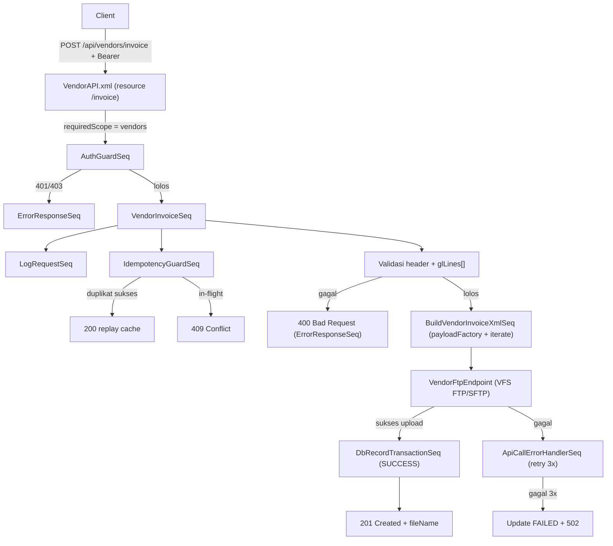

# API Guide — Vendor Invoice Posting (XML → FTP)
## ASSA Middleware — WSO2 Micro Integrator

> **Created By**: Nobi Sumariga

> **Created At**: 15 September 2026

> **Untuk**: Developer (assignment task)
> **Tujuan**: Membangun endpoint baru yang menerima payload **Vendor Invoice / FI Posting**, **membentuk file XML**, lalu **mengirim file XML tersebut ke server FTP** (file-based interface). SAP mengambil file dari FTP untuk diposting sebagai dokumen invoice vendor (AP).

---

## Daftar Isi
1. [Ringkasan Fitur](#1-ringkasan-fitur)
2. [Kontrak API (Request)](#2-kontrak-api-request)
3. [Spesifikasi & Validasi Field](#3-spesifikasi--validasi-field)
4. [Struktur File XML Target](#4-struktur-file-xml-target)
5. [Aturan Penamaan File & Tujuan FTP](#5-aturan-penamaan-file--tujuan-ftp)
6. [Alur Proses (Flow)](#6-alur-proses-flow)
7. [Kontrak Response](#7-kontrak-response)
8. [Konfigurasi yang Perlu Ditambahkan](#8-konfigurasi-yang-perlu-ditambahkan)
9. [SOP Implementasi (Langkah Developer)](#9-sop-implementasi-langkah-developer)
10. [Checklist Acceptance](#10-checklist-acceptance)

---

## 1. Ringkasan Fitur

| Item | Nilai |
|---|---|
| **Nama fitur** | Vendor Invoice Posting via File Interface |
| **Method & Path** | `POST /api/vendors/invoice` |
| **Auth** | Wajib Bearer Token + scope `vendors` (mengikuti `AuthGuardSeq`) |
| **Input** | JSON body berisi header invoice + baris GL (line items) |
| **Output artefak** | Satu file XML per request |
| **Tujuan pengiriman** | Server FTP (folder inbound SAP) |
| **Pola arsitektur** | API → AuthGuard → DomainSeq → validasi → BuildXML → FTP send → response |

Sama seperti fitur **Vendor Create**, endpoint ini **tidak** melakukan HTTP call langsung ke SAP Core. Ia menulis file XML dan mengunggahnya ke FTP menggunakan VFS transport WSO2 MI.

> **Catatan struktur data**: field `GL Account`, `GL Amount`, `GL Assignment`, `GL Text`, `Cost Center`, dan `Order` merepresentasikan **baris posting (line item)** yang bisa lebih dari satu. Karena itu di JSON dimodelkan sebagai array `glLines[]`. Field lainnya bersifat **header** (satu nilai per dokumen).

---

## 2. Kontrak API (Request)

```
POST /api/vendors/invoice
Host: {middleware-host}:8290
Authorization: Bearer <token>
Content-Type: application/json
X-Transaction-Id: <uuid opsional untuk idempotency>
```

### Contoh Request Body

```json
{
  "vendorCode": "0000100234",
  "invoiceDate": "2026-09-10",
  "reference": "INV/2026/09/00123",
  "postingDate": "2026-09-15",
  "documentType": "KR",
  "amount": 15000000.00,
  "currency": "IDR",
  "taxType": "V3",
  "taxAmount": 1500000.00,
  "text": "Pembayaran jasa maintenance September 2026",
  "baselineDate": "2026-09-15",
  "paymentTerms": "T030",
  "assignment": "PO-4500012345",
  "headerText": "Invoice jasa vendor unit",
  "businessArea": "1000",
  "repCountry": "ID",
  "withholdingTaxCode": "23",
  "withholdingTaxAmount": 300000.00,
  "withholdingTaxBase": 15000000.00,
  "glLines": [
    {
      "glAccount": "6110000000",
      "glAmount": 15000000.00,
      "glAssignment": "PO-4500012345",
      "glText": "Biaya maintenance",
      "costCenter": "CC-1000-01",
      "order": ""
    }
  ]
}
```

---

## 3. Spesifikasi & Validasi Field

Validasi dilakukan di sequence sebelum XML dibentuk. Gagal validasi → `400 Bad Request` via `ErrorResponseSeq` dengan `detail` yang menyebut field bermasalah.

### 3.1 Header Invoice

| No | Field (JSON) | Label | Aturan Validasi | Wajib |
|---|---|---|---|---|
| 1 | `vendorCode` | Kode Vendor | String, kode vendor SAP (mis. 10 digit). Wajib ada | Ya |
| 2 | `invoiceDate` | Tanggal Invoice | Format tanggal `YYYY-MM-DD`, valid | Ya |
| 3 | `reference` | Reference | String (nomor referensi/faktur), max 16 char | Ya |
| 4 | `postingDate` | Tanggal Posting | Format `YYYY-MM-DD`, valid | Ya |
| 5 | `documentType` | Tipe Dokumen | Kode tipe dokumen SAP (mis. `KR`, `KG`), 2 char | Ya |
| 6 | `amount` | Amount | Numerik/desimal > 0 | Ya |
| 7 | `currency` | Kurs | Kode mata uang ISO (mis. `IDR`, `USD`) | Ya |
| 8 | `taxType` | Tax Type | Kode tax type SAP | Kondisional* |
| 9 | `taxAmount` | Tax Amount | Numerik/desimal ≥ 0 | Kondisional* |
| 10 | `text` | Text | String, max 50 char | Tidak |
| 17 | `baselineDate` | Baseline Date | Format `YYYY-MM-DD`, valid | Ya |
| 18 | `paymentTerms` | Payment Terms | Kode payment terms (mis. `T000`–`T120`) | Ya |
| 19 | `assignment` | Assignment | String, max 18 char | Tidak |
| 20 | `headerText` | Header Text | String, max 25 char | Tidak |
| 21 | `businessArea` | Business Area | Kode business area SAP, 4 char | Tidak |
| 22 | `repCountry` | Rep Country | Kode negara ISO (mis. `ID`) | Kondisional** |
| 23 | `withholdingTaxCode` | Withholding Tax Code | Kode WHT SAP | Kondisional** |
| 24 | `withholdingTaxAmount` | Withholding Tax Amount | Numerik/desimal ≥ 0 | Kondisional** |
| 25 | `withholdingTaxBase` | Withholding Tax Base | Numerik/desimal ≥ 0 | Kondisional** |

### 3.2 GL Line Items (`glLines[]`, minimal 1 baris)

| No | Field (JSON) | Label | Aturan Validasi | Wajib |
|---|---|---|---|---|
| 11 | `glAccount` | GL Account | Kode GL account SAP. Wajib per baris | Ya |
| 12 | `glAmount` | GL Amount | Numerik/desimal ≠ 0 per baris | Ya |
| 13 | `glAssignment` | GL Assignment | String, max 18 char | Tidak |
| 14 | `glText` | GL Text | String, max 50 char | Tidak |
| 15 | `costCenter` | Cost Center | Kode cost center SAP | Kondisional*** |
| 16 | `order` | Order | Kode internal order SAP | Kondisional*** |

> **\* Tax (8–9)**: bila `taxType` diisi, `taxAmount` wajib diisi (dan sebaliknya).
> **\*\* Withholding tax (22–25)**: bila `withholdingTaxCode` diisi, maka `repCountry`, `withholdingTaxAmount`, dan `withholdingTaxBase` wajib diisi.
> **\*\*\* Cost object (15–16)**: `costCenter` dan `order` bersifat alternatif (biasanya hanya salah satu yang diisi per baris, sesuai aturan cost object SAP). Validasi: jangan izinkan keduanya kosong bila GL account membutuhkan cost object (opsional — sesuaikan dengan aturan bisnis).

### 3.3 Aturan validasi umum
- Trim whitespace pada field string sebelum cek panjang.
- Field enum/kode: bandingkan **kode**, bukan deskripsi.
- Field angka: pastikan numerik valid, gunakan titik `.` sebagai desimal, tanpa pemisah ribuan.
- Konsistensi keseimbangan: **total `glAmount` seluruh baris** sebaiknya sama dengan `amount` header (bila aturan bisnis mengharuskan balance debit/kredit). Tandai sebagai validasi opsional yang dapat diaktifkan.
- Panjang string melebihi batas → `400` (jangan auto-truncate).

---

## 4. Struktur File XML Target

XML dibentuk dari payload dengan `<payloadFactory>` (media-type `xml`) atau XSLT. Struktur usulan (sesuaikan tag dengan spesifikasi interface SAP bila ada — mis. IDoc `ACC_DOCUMENT`):

```xml
<?xml version="1.0" encoding="UTF-8"?>
<VendorInvoice>
  <Header>
    <TransactionId>{X-Transaction-Id}</TransactionId>
    <CorrelationId>{X-Correlation-Id}</CorrelationId>
    <CreatedAt>{ISO-8601 timestamp}</CreatedAt>
    <Source>ASSA-MIDDLEWARE</Source>
  </Header>
  <Invoice>
    <VendorCode>0000100234</VendorCode>
    <InvoiceDate>2026-09-10</InvoiceDate>
    <Reference>INV/2026/09/00123</Reference>
    <PostingDate>2026-09-15</PostingDate>
    <DocumentType>KR</DocumentType>
    <Amount>15000000.00</Amount>
    <Currency>IDR</Currency>
    <BaselineDate>2026-09-15</BaselineDate>
    <PaymentTerms>T030</PaymentTerms>
    <Assignment>PO-4500012345</Assignment>
    <HeaderText>Invoice jasa vendor unit</HeaderText>
    <BusinessArea>1000</BusinessArea>
    <Text>Pembayaran jasa maintenance September 2026</Text>
    <Tax>
      <TaxType>V3</TaxType>
      <TaxAmount>1500000.00</TaxAmount>
    </Tax>
    <WithholdingTax>
      <RepCountry>ID</RepCountry>
      <Code>23</Code>
      <Amount>300000.00</Amount>
      <Base>15000000.00</Base>
    </WithholdingTax>
    <GLLines>
      <GLLine>
        <Account>6110000000</Account>
        <Amount>15000000.00</Amount>
        <Assignment>PO-4500012345</Assignment>
        <Text>Biaya maintenance</Text>
        <CostCenter>CC-1000-01</CostCenter>
        <Order/>
      </GLLine>
    </GLLines>
  </Invoice>
</VendorInvoice>
```

> **Encoding**: escape karakter khusus (`&`, `<`, `>`). Untuk `glLines[]` yang berulang, gunakan iterasi (mis. `<iterate>`/XSLT `for-each`) agar semua baris tergenerate. Bila memakai `payloadFactory`, gunakan argumen berparameter agar escaping aman dari XML injection.

---

## 5. Aturan Penamaan File & Tujuan FTP

### Nama file
Format: `VENDINV_{vendorCode}_{transactionId}_{yyyyMMddHHmmss}.xml`

Contoh: `VENDINV_0000100234_3f9ab2c1_20260915103245.xml`

- `transactionId` dari `X-Transaction-Id`; bila tidak dikirim, generate UUID.
- Timestamp zona `Asia/Jakarta`.

### Tujuan FTP
Gunakan **VFS transport** WSO2 MI. Detail koneksi FTP **tidak di-hardcode** — simpan di `config.properties` / environment variable.

```
vfs:ftp://<user>:<pass>@<host>:<port>/<remote-dir>?vfs.passive=true
```

Gunakan **staging + rename** agar SAP tidak membaca file setengah tertulis:
1. Tulis ke folder/nama sementara (`.staging/` atau `*.tmp`).
2. Setelah selesai, rename ke nama final `.xml`.

> **Keamanan**: prefer **SFTP/FTPS**. Kredensial FTP lewat Secure Vault / secret manager, jangan plaintext.

> **Reuse**: fitur ini dapat memakai konfigurasi FTP yang sama dengan **Vendor Create** (`ftp.vendor.*`), atau folder inbound terpisah untuk invoice bila SAP memisahkan interface. Konfirmasikan dengan tim SAP.

---

## 6. Alur Proses (Flow)



Reuse komponen existing: `AuthGuardSeq`, `LogRequestSeq`, `IdempotencyGuardSeq`, `SafeApiCallWithRetrySeq`, `ApiCallErrorHandlerSeq`, `DbRecordTransactionSeq`, `DbRecordAttemptLogSeq`, `ErrorResponseSeq`. Baru: **resource `/invoice`** pada `VendorAPI.xml`, **VendorInvoiceSeq**, dan (reuse) **VendorFtpEndpoint**.

---

## 7. Kontrak Response

### Sukses — `201 Created`
```json
{
  "success": true,
  "message": "Vendor invoice accepted and delivered to FTP",
  "transactionId": "3f9ab2c1",
  "fileName": "VENDINV_0000100234_3f9ab2c1_20260915103245.xml",
  "correlationId": "corr-20260915..."
}
```

### Gagal validasi — `400 Bad Request`
```json
{
  "error": true,
  "message": "Bad Request",
  "detail": "glLines[0].glAccount wajib diisi"
}
```

### Gagal kirim FTP setelah retry — `502 Bad Gateway`
```json
{
  "error": true,
  "message": "Bad Gateway",
  "detail": "Gagal mengirim file ke FTP setelah 3x percobaan"
}
```

### Duplikat — `409 Conflict` (dari IdempotencyGuardSeq)

---

## 8. Konfigurasi yang Perlu Ditambahkan

Bila belum ada dari fitur Vendor Create, tambahkan ke `src/main/wso2mi/resources/conf/config.properties` (kredensial pakai Secure Vault):

```properties
# ------------------------------------------------------------------------------
# Vendor Invoice — FTP Interface
# ------------------------------------------------------------------------------
ftp.vendor.host=ftp.internal.assa.id
ftp.vendor.port=21
ftp.vendor.username=svc_vendor
ftp.vendor.password=__USE_SECURE_VAULT__
ftp.vendor.protocol=ftp   # ftp | sftp | ftps
ftp.vendor.passive=true

# Folder inbound khusus invoice (boleh sama atau beda dengan vendor master)
ftp.vendor.invoice.remote.dir=/inbound/vendor-invoice
ftp.vendor.invoice.staging.dir=/inbound/vendor-invoice/.staging

# App Registry: pastikan scope 'vendors' aktif untuk aplikasi yang berhak
# auth.app.app_a.scopes=branches,customers,vehicles,vendors
```

Aktifkan **VFS transport** di `deployment/deployment.toml` (bila belum):
```toml
[transport.vfs]
listener_enable = true
sender_enable = true
```

---

## 9. SOP Implementasi (Langkah Developer)

### Langkah 1 — Pastikan scope `vendors` terdaftar
Cek `config.properties`, `vendors` sudah ada pada `auth.app.<appId>.scopes` aplikasi yang berhak.

### Langkah 2 — Tambahkan resource `/invoice` pada `VendorAPI.xml`
Lokasi: `src/main/wso2mi/artifacts/apis/VendorAPI.xml`
```xml
<resource methods="POST" uri-template="/invoice">
    <inSequence>
        <property name="requiredScope" value="vendors" scope="default" type="STRING"/>
        <sequence key="AuthGuardSeq"/>
        <sequence key="VendorInvoiceSeq"/>
    </inSequence>
    <faultSequence>
        <sequence key="ErrorResponseSeq"/>
    </faultSequence>
</resource>
```

### Langkah 3 — Reuse `VendorFtpEndpoint.xml`
Gunakan endpoint VFS yang sama dengan fitur Vendor Create. Bila SAP memakai folder inbound berbeda untuk invoice, arahkan `uri.var.*` ke `ftp.vendor.invoice.remote.dir`.

### Langkah 4 — Buat `VendorInvoiceSeq.xml`
Lokasi: `src/main/wso2mi/artifacts/sequences/VendorInvoiceSeq.xml`. Isi:
1. Ekstrak header via `json-eval($.<field>)` dan baris via `json-eval($.glLines)`.
2. Validasi header + setiap baris `glLines[]` sesuai [Bagian 3](#3-spesifikasi--validasi-field). Gagal → set `errorCode`/`errorMessage` lalu `ErrorResponseSeq`.
3. Set `api.endpoint = /api/vendors/invoice`, panggil `LogRequestSeq` & `IdempotencyGuardSeq`.
4. Bentuk XML: header via `payloadFactory`; baris `glLines[]` di-generate berulang (mis. `<iterate>` atau XSLT `for-each`) → lihat [Bagian 4](#4-struktur-file-xml-target).
5. Set nama file & `transport.vfs.ReplyFileName`, kirim ke `VendorFtpEndpoint` dibungkus `SafeApiCallWithRetrySeq` (retry 3x + DB logging).
6. Sukses → `DbRecordTransactionSeq` status `SUCCESS`, balas `201`.

### Langkah 5 — Build & uji
```powershell
mvn clean package
```
Jalankan server/container, uji dengan Postman/`curl` (payload di [Bagian 2](#2-kontrak-api-request)), verifikasi file XML muncul di folder FTP dan seluruh `glLines` tergenerate.

---

## 10. Checklist Acceptance

- [ ] `POST /api/vendors/invoice` menolak tanpa token (`401`) dan tanpa scope `vendors` (`403`).
- [ ] Validasi header lengkap (tanggal, amount, currency, payment terms, dsb.).
- [ ] `glLines[]` wajib minimal 1 baris; tiap baris tervalidasi (`glAccount`, `glAmount`).
- [ ] Aturan kondisional tax & withholding tax dijalankan benar.
- [ ] (Opsional) Validasi balance total `glAmount` vs `amount` header aktif bila diperlukan bisnis.
- [ ] Panjang string melebihi batas ditolak `400` (tanpa truncate).
- [ ] File XML terbentuk dengan semua baris `glLines` & karakter khusus ter-escape.
- [ ] File terkirim ke FTP dengan pola nama `VENDINV_{vendorCode}_{transactionId}_{timestamp}.xml`.
- [ ] Staging + rename mencegah SAP membaca file parsial.
- [ ] Kegagalan FTP memicu retry 3x lalu `502`, transaksi tercatat `FAILED`.
- [ ] Idempotency berfungsi (replay `200`, in-flight `409`).
- [ ] Tidak ada kredensial FTP plaintext yang di-commit.
- [ ] Response sukses `201` memuat `transactionId` & `fileName`.

---

## Lampiran — Ringkasan Field (24 field asli)

| # | Field | Lokasi di JSON | Level |
|---|---|---|---|
| 1 | Kode Vendor | `vendorCode` | Header |
| 2 | Tanggal invoice | `invoiceDate` | Header |
| 3 | Reference | `reference` | Header |
| 4 | Tanggal Posting | `postingDate` | Header |
| 5 | Tipe Dokumen | `documentType` | Header |
| 6 | Amount | `amount` | Header |
| 7 | Kurs | `currency` | Header |
| 8 | Tax Type | `taxType` | Header |
| 9 | Tax Amount | `taxAmount` | Header |
| 10 | Text | `text` | Header |
| 11 | GL Account | `glLines[].glAccount` | Line |
| 12 | GL Amount | `glLines[].glAmount` | Line |
| 13 | GL Assignment | `glLines[].glAssignment` | Line |
| 14 | GL Text | `glLines[].glText` | Line |
| 15 | Cost Center | `glLines[].costCenter` | Line |
| 16 | Order | `glLines[].order` | Line |
| 17 | Baseline Date | `baselineDate` | Header |
| 18 | Payment Terms | `paymentTerms` | Header |
| 19 | Assignment | `assignment` | Header |
| 20 | Header Text | `headerText` | Header |
| 21 | Business Area | `businessArea` | Header |
| 22 | Rep Country | `repCountry` | Header |
| 23 | Withholding Tax Code | `withholdingTaxCode` | Header |
| 24 | Withholding Tax Amount | `withholdingTaxAmount` | Header |
| — | Withholding Tax Base | `withholdingTaxBase` | Header |

---

*Dokumen assignment ini mengikuti pola arsitektur ASSA Middleware (lihat `STRUKTUR_ARSITEKTUR_LENGKAP.md`, `SOFTWARE_ARCHITECTURE_DOCUMENT.md`, dan `GUIDE_VENDOR_CREATE_XML_FTP.md`). Reuse sequence & endpoint FTP yang ada, hindari hardcoding konfigurasi.*
