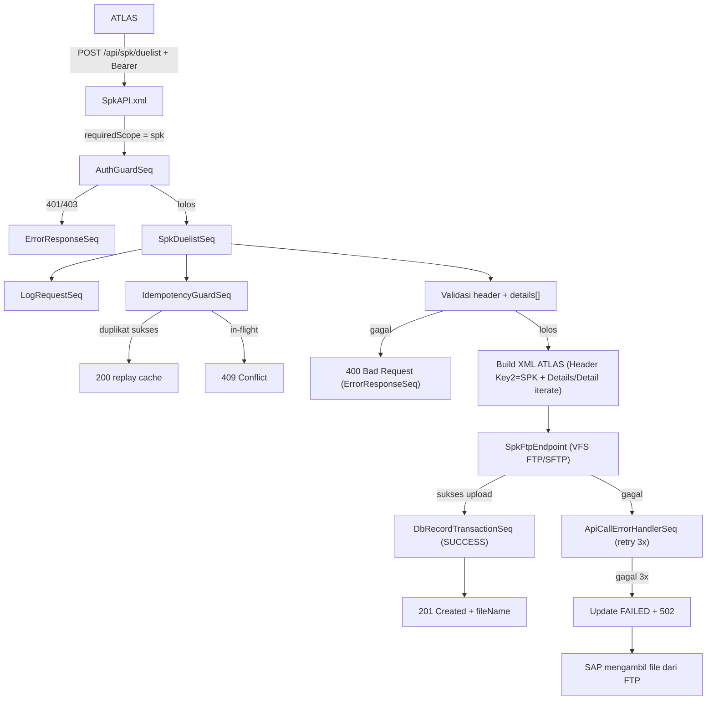

# API Guide — SPK Duelist (XML → FTP) — **Version 2**
## ASSA Middleware — WSO2 Micro Integrator

> **Created By**: Nobi Sumariga

> **Created At**: 16 September 2026

> **Untuk**: Developer (assignment task)
> **Alur**: `ATLAS → Middleware → XML → FTP → SAP`
> **Perubahan v2**: Penyesuaian daftar field SPK/Duelist (27 field) dan **format XML resmi ATLAS** (`Transaction` → `Header` + `TransactionDatas`, dengan nested `Details/Detail`). Menggantikan konten v1 (`GUIDE_SPK_DUELIST_XML_FTP.md`).
> **Referensi format**: `ref/SPK_Duelist_00001.xml`

---

## Daftar Isi
1. [Ringkasan Fitur](#1-ringkasan-fitur)
2. [Perubahan dari V1](#2-perubahan-dari-v1)
3. [Kontrak API (Request)](#3-kontrak-api-request)
4. [Spesifikasi & Validasi Field](#4-spesifikasi--validasi-field)
5. [Struktur File XML Target (Format ATLAS)](#5-struktur-file-xml-target-format-atlas)
6. [Pemetaan Field JSON → XML](#6-pemetaan-field-json--xml)
7. [Aturan Penamaan File & Tujuan FTP](#7-aturan-penamaan-file--tujuan-ftp)
8. [Alur Proses (Flow)](#8-alur-proses-flow)
9. [Kontrak Response](#9-kontrak-response)
10. [Konfigurasi yang Perlu Ditambahkan](#10-konfigurasi-yang-perlu-ditambahkan)
11. [SOP Implementasi (Langkah Developer)](#11-sop-implementasi-langkah-developer)
12. [Checklist Acceptance](#12-checklist-acceptance)

---

## 1. Ringkasan Fitur

| Item | Nilai |
|---|---|
| **Nama fitur** | SPK Duelist Create via File Interface |
| **Method & Path** | `POST /api/spk/duelist` |
| **Auth** | Wajib Bearer Token + scope `spk` (`AuthGuardSeq`) |
| **Consumer** | ATLAS |
| **Input** | JSON body: header SPK + detail item (jasa & parts) + info invoice |
| **Output artefak** | Satu file XML format ATLAS (`Key2 = SPK`) |
| **Tujuan pengiriman** | Server FTP (folder inbound SAP) |
| **Alur** | ATLAS → Middleware → bentuk XML → FTP → SAP mengambil file |

SPK Duelist merepresentasikan Surat Perintah Kerja (maintenance/perbaikan kendaraan) berisi **rincian item** (jasa & parts) yang bisa lebih dari satu baris, ditambah informasi invoice untuk posting AP.

---

## 2. Perubahan dari V1

| Aspek | V1 | V2 (dokumen ini) |
|---|---|---|
| Domain | Vendor Invoice generik (`/api/vendors/invoice`) | **SPK Duelist** (`/api/spk/duelist`) |
| Daftar field | 24 field GL posting | **27 field SPK** (header + jasa + parts + invoice) |
| Struktur XML | `<VendorInvoice>` custom | **Format ATLAS**: `<Transaction><Header Key2=SPK/><TransactionDatas>` dengan nested `<Details><Detail>` |
| Line item | `glLines[]` (GL posting) | `details[]` (item jasa & parts, ada `Komponen`) |
| Header XML | Tidak ada | Wajib blok `<Header>` ATLAS (`ID=ATLAS`, `Key2=SPK`) |

---

## 3. Kontrak API (Request)

```
POST /api/spk/duelist
Host: {middleware-host}:8290
Authorization: Bearer <token>
Content-Type: application/json
X-Transaction-Id: <uuid opsional untuk idempotency>
X-Forwarded-For: <IP pengirim, dipakai untuk Header/IPAddress>
```

### Contoh Request Body (V2)

```json
{
  "noSpk": "SPK/2026/09/00001",
  "type": "Maintenance",
  "noPolisi": "B-2120-BKZ",
  "noSr": "SR-000123",
  "category": "Maintenance",
  "subCategory": "Adhoc",
  "vendorReferensi": "0001",
  "namaVendor": "Bengkel Jaya Motor",
  "picService": "PIC-001",
  "namaPicService": "Andi Wijaya",
  "spkRework": "No",
  "totalPrice": 1850000,
  "createdAt": "2026-09-16 14:46:11",
  "createdBy": "atlas.user",

  "poSpkNumber": "PO-4500012345",
  "invoiceNumber": "INV_BKL_00001",
  "invoiceDate": "2026-09-16",
  "invoiceAmount": 1850000,
  "memo": "Perbaikan AC dan penggantian ban",
  "taxInvoiceNumber": "314650102340592",
  "taxInvoiceDate": "2026-09-16",

  "businessArea": "1101",

  "details": [
    { "jenis": "Jasa",  "description": "Jasa Perbaikan AC", "qty": 1, "price": 150000 },
    { "jenis": "Parts", "description": "Filter AC",         "qty": 1, "price": 150000 },
    { "jenis": "Parts", "description": "Ban Depan Kiri",    "qty": 1, "price": 3500000 }
  ]
}
```

> **Catatan model data**: field 12–17 (Jasa Description/Qty/Price dan Parts Description/Qty/Price) di daftar penyesuaian merepresentasikan **baris item** yang berulang. Di JSON dimodelkan sebagai array `details[]`, dengan `jenis` = `Jasa` atau `Parts` (dipetakan ke `<Komponen>` di XML). Ini konsisten dengan `ref/SPK_Duelist_00001.xml`.

---

## 4. Spesifikasi & Validasi Field

Validasi dilakukan di sequence sebelum XML dibentuk. Gagal → `400 Bad Request` via `ErrorResponseSeq`.

### 4.1 Header SPK

| No | Field (JSON) | Label | Aturan Validasi | Wajib |
|---|---|---|---|---|
| 1 | `noSpk` | No SPK | String, nomor SPK → `<Header><DocumentNumber>`. Wajib | Ya |
| 2 | `type` | Type | String/enum tipe SPK (mis. `Maintenance`) | Ya |
| 3 | `noPolisi` | No Polisi | String nomor polisi kendaraan (mis. `B-2120-BKZ`) | Ya |
| 4 | `noSr` | No SR | String nomor Service Request | Tidak |
| 5 | `category` | Category | String/enum (mis. `Maintenance`) | Ya |
| 6 | `subCategory` | Sub-Category | String/enum (mis. `Adhoc`) | Ya |
| 7 | `vendorReferensi` | Vendor Referensi | Kode/ID vendor (mis. `0001`) → `<Vendor_ID>` | Ya |
| 8 | `namaVendor` | Nama Vendor | Free text nama vendor | Tidak |
| 9 | `picService` | PIC Service | Kode/ID PIC | Tidak |
| 10 | `namaPicService` | Nama PIC Service | Free text | Tidak |
| 11 | `spkRework` | SPK Rework | Enum: `Yes` / `No` | Tidak |
| 18 | `totalPrice` | Total Price | Numerik > 0 → `<Total_Price>` | Ya |
| 19 | `createdAt` | Created At | Timestamp `YYYY-MM-DD HH:mm:ss` | Ya |
| 20 | `createdBy` | Created By | String user pembuat | Ya |
| — | `businessArea` | Business Area | Kode business area SAP (mis. `1101`) → `<Business_Area>` | Ya |

### 4.2 Detail Item (`details[]`, minimal 1 baris)

Field 12–17 (Jasa & Parts) dimodelkan sebagai baris `details[]`:

| No (asli) | Field (JSON) | Label | Aturan Validasi | Wajib |
|---|---|---|---|---|
| 12/15 | `details[].description` | Jasa/Parts Description | Free text deskripsi item | Ya |
| 13/16 | `details[].qty` | Jasa/Parts Qty | Numerik/integer > 0 | Ya |
| 14/17 | `details[].price` | Jasa/Parts Price | Numerik > 0 | Ya |
| — | `details[].jenis` | Komponen | Enum: `Jasa` / `Parts` (`Item`) → `<Komponen>` | Ya |

### 4.3 Info Invoice (Header)

| No | Field (JSON) | Label | Aturan Validasi | Wajib |
|---|---|---|---|---|
| 21 | `poSpkNumber` | PO/SPK Number | String nomor PO/SPK | Kondisional* |
| 22 | `invoiceNumber` | Invoice Number | String → `<Invoice_Number>` | Kondisional* |
| 23 | `invoiceDate` | Invoice Date | Tanggal (di XML format `dd.MM.yyyy`) → `<Invoice_Date>` | Kondisional* |
| 24 | `invoiceAmount` | Invoice Amount | Numerik > 0 | Kondisional* |
| 25 | `memo` | Memo | Free text | Tidak |
| 26 | `taxInvoiceNumber` | Tax Invoice Number | String nomor faktur pajak → `<Tax_InvoiceNo>` | Kondisional* |
| 27 | `taxInvoiceDate` | Tax Invoice Date | Tanggal (format `dd.MM.yyyy`) → `<Tax_date>` | Kondisional* |

> **\* Blok invoice (21–27)**: bila SPK dikirim beserta invoice (posting sekaligus), field invoice inti (`invoiceNumber`, `invoiceDate`, `invoiceAmount`) wajib. Bila SPK dikirim tanpa invoice (baru SPK saja), blok ini boleh kosong. **Konfirmasikan aturan final dengan tim SAP/ATLAS.**

### 4.4 Aturan validasi umum
- Trim whitespace pada field string sebelum cek panjang.
- Field enum: bandingkan **nilai** (mis. `Jasa`, `Parts`, `Yes`, `No`), sesuai kesepakatan case.
- Field tanggal di JSON pakai ISO `YYYY-MM-DD`; middleware mengonversi ke format XML ATLAS `dd.MM.yyyy` (lihat contoh `16.09.2026`).
- Field angka: numerik valid, titik `.` sebagai desimal, tanpa pemisah ribuan.
- (Opsional) Validasi konsistensi: total (`qty × price`) seluruh `details[]` = `totalPrice`. Aktifkan bila diminta bisnis.
- Panjang string melebihi batas → `400` (tanpa auto-truncate).

---

## 5. Struktur File XML Target (Format ATLAS)

XML **wajib** mengikuti format resmi ATLAS (referensi `ref/SPK_Duelist_00001.xml`). Blok `<Header>` standar; penanda SPK adalah `Key2 = SPK`.

> **Catatan**: contoh mentah pada `ref/SPK_Duelist_00001.xml` memiliki beberapa tag yang belum tertutup rapi (`<Detail>` tanpa penutup, `<Tax_InvoiceNo>` ditutup `</Tax_invoice>`, `<Details>` pembuka ganda). XML yang dihasilkan middleware **wajib well-formed** seperti template di bawah ini.

```xml
<?xml version="1.0" encoding="UTF-8"?>
<Transaction>
	<Header>
		<ID>ATLAS</ID>
		<TransGuID>2026-09-16 14:46:11-SPK</TransGuID>
		<DocumentNumber>SPK/2026/09/00001</DocumentNumber>
		<FileType>XML</FileType>
		<IPAddress>10.20.30.40</IPAddress>
		<DestinationUser>SAP</DestinationUser>
		<Key1>ATLAS</Key1>
		<Key2>SPK</Key2>
		<DataLength>1</DataLength>
	</Header>
	<TransactionDatas>
		<TransactionData>
			<No_Polisi>B-2120-BKZ</No_Polisi>
			<Business_Area>1101</Business_Area>
			<Category>Maintenance</Category>
			<Sub_Category>Adhoc</Sub_Category>
			<Vendor_ID>0001</Vendor_ID>
			<Total_Price>1850000</Total_Price>
			<Invoice_Number>INV_BKL_00001</Invoice_Number>
			<Invoice_Date>16.09.2026</Invoice_Date>
			<Tax_InvoiceNo>314650102340592</Tax_InvoiceNo>
			<Tax_date>16.09.2026</Tax_date>
			<Details>
				<Detail>
					<Item_Desc>Jasa Perbaikan AC</Item_Desc>
					<Item_Qty>1</Item_Qty>
					<Item_Price>150000</Item_Price>
					<Komponen>Jasa</Komponen>
				</Detail>
				<Detail>
					<Item_Desc>Filter AC</Item_Desc>
					<Item_Qty>1</Item_Qty>
					<Item_Price>150000</Item_Price>
					<Komponen>Item</Komponen>
				</Detail>
				<Detail>
					<Item_Desc>Ban Depan Kiri</Item_Desc>
					<Item_Qty>1</Item_Qty>
					<Item_Price>3500000</Item_Price>
					<Komponen>Item</Komponen>
				</Detail>
			</Details>
		</TransactionData>
	</TransactionDatas>
</Transaction>
```

### Aturan pengisian Header

| Tag Header | Nilai | Sumber |
|---|---|---|
| `ID` | `ATLAS` | Konstanta |
| `TransGuID` | `{yyyy-MM-dd HH:mm:ss}-SPK` | Timestamp server (Asia/Jakarta) + suffix `-SPK` |
| `DocumentNumber` | Nomor SPK | Field `noSpk` |
| `FileType` | `XML` | Konstanta |
| `IPAddress` | IP pengirim | Header `X-Forwarded-For` / remote address |
| `DestinationUser` | `SAP` | Konstanta |
| `Key1` | `ATLAS` | Konstanta |
| `Key2` | `SPK` | Konstanta (penanda interface SPK Duelist) |
| `DataLength` | `1` | Jumlah `<TransactionData>` (SPK = 1 per file) |

> **Encoding**: escape karakter khusus (`&`, `<`, `>`). Untuk `details[]` gunakan iterasi (`<iterate>`/XSLT `for-each`) agar semua baris `<Detail>` tergenerate. Pakai argumen berparameter `payloadFactory` agar escaping aman dari XML injection.
>
> **Nilai `Komponen`**: `jenis = "Jasa"` → `<Komponen>Jasa</Komponen>`; `jenis = "Parts"` → `<Komponen>Item</Komponen>` (mengikuti contoh, "Item" dipakai untuk parts). **Konfirmasikan mapping ini dengan tim SAP.**

---

## 6. Pemetaan Field JSON → XML

| Field JSON | Tag XML | Keterangan |
|---|---|---|
| `noSpk` | `<Header><DocumentNumber>` | Nomor SPK |
| `noPolisi` | `<No_Polisi>` | |
| `businessArea` | `<Business_Area>` | |
| `category` | `<Category>` | |
| `subCategory` | `<Sub_Category>` | |
| `vendorReferensi` | `<Vendor_ID>` | |
| `totalPrice` | `<Total_Price>` | |
| `invoiceNumber` | `<Invoice_Number>` | |
| `invoiceDate` | `<Invoice_Date>` | Konversi ke `dd.MM.yyyy` |
| `taxInvoiceNumber` | `<Tax_InvoiceNo>` | |
| `taxInvoiceDate` | `<Tax_date>` | Konversi ke `dd.MM.yyyy` |
| `details[].description` | `<Detail><Item_Desc>` | Per baris |
| `details[].qty` | `<Detail><Item_Qty>` | Per baris |
| `details[].price` | `<Detail><Item_Price>` | Per baris |
| `details[].jenis` | `<Detail><Komponen>` | `Jasa` / `Item` |

> ⚠️ **Field yang belum ada tag di contoh XML** (perlu konfirmasi ke tim SAP/ATLAS apakah perlu tag baru atau hanya untuk keperluan internal middleware):
> `type`, `noSr`, `namaVendor`, `picService`, `namaPicService`, `spkRework`, `createdAt`, `createdBy`, `poSpkNumber`, `invoiceAmount`, `memo`.
> **Jangan tambahkan tag baru ke XML sebelum dikonfirmasi** agar file tidak ditolak parser SAP. `createdAt` sebaiknya dipakai untuk menyusun `TransGuID`.

---

## 7. Aturan Penamaan File & Tujuan FTP

### Nama file
Ikuti konvensi ATLAS pada referensi (`SPK_Duelist_00001.xml`):

Format: `SPK_Duelist_{sequence5digit}.xml` — contoh: `SPK_Duelist_00001.xml`

Alternatif dengan keunikan lintas node: `SPK_Duelist_{yyyyMMddHHmmss}_{transactionId}.xml`. **Konfirmasikan konvensi final dengan tim SAP** (penamaan file adalah bagian kontrak interface).

### Tujuan FTP
Gunakan **VFS transport** WSO2 MI. Detail koneksi FTP **tidak di-hardcode** — simpan di `config.properties` / environment variable.

```
vfs:ftp://<user>:<pass>@<host>:<port>/<remote-dir>?vfs.passive=true
```

Gunakan **staging + rename** agar SAP tidak membaca file setengah tertulis:
1. Tulis ke folder/nama sementara (`.staging/` atau `*.tmp`).
2. Setelah selesai, rename ke nama final `.xml`.

> **Keamanan**: prefer **SFTP/FTPS**. Kredensial FTP lewat Secure Vault / secret manager, jangan plaintext.

---

## 8. Alur Proses (Flow)



Reuse komponen existing: `AuthGuardSeq`, `LogRequestSeq`, `IdempotencyGuardSeq`, `SafeApiCallWithRetrySeq`, `ApiCallErrorHandlerSeq`, `DbRecordTransactionSeq`, `DbRecordAttemptLogSeq`, `ErrorResponseSeq`. Baru: **SpkAPI**, **SpkDuelistSeq**, **SpkFtpEndpoint** (boleh reuse endpoint FTP yang sama dengan folder berbeda).

---

## 9. Kontrak Response

### Sukses — `201 Created`
```json
{
  "success": true,
  "message": "SPK Duelist accepted and delivered to FTP",
  "transactionId": "3f9ab2c1",
  "fileName": "SPK_Duelist_00001.xml",
  "documentNumber": "SPK/2026/09/00001"
}
```

### Gagal validasi — `400 Bad Request`
```json
{
  "error": true,
  "message": "Bad Request",
  "detail": "details[0].qty harus lebih besar dari 0"
}
```

### Gagal kirim FTP setelah retry — `502 Bad Gateway`
```json
{
  "error": true,
  "message": "Bad Gateway",
  "detail": "Gagal mengirim file ke FTP setelah 3x percobaan"
}
```

### Duplikat — `409 Conflict` (dari IdempotencyGuardSeq)

---

## 10. Konfigurasi yang Perlu Ditambahkan

Tambahkan ke `src/main/wso2mi/resources/conf/config.properties` (kredensial pakai Secure Vault):

```properties
# ------------------------------------------------------------------------------
# SPK Duelist — FTP Interface & ATLAS Header
# ------------------------------------------------------------------------------
ftp.spk.host=ftp.internal.assa.id
ftp.spk.port=21
ftp.spk.username=svc_spk
ftp.spk.password=__USE_SECURE_VAULT__
ftp.spk.protocol=ftp            # ftp | sftp | ftps
ftp.spk.passive=true
ftp.spk.remote.dir=/inbound/spk
ftp.spk.staging.dir=/inbound/spk/.staging

# ATLAS Header constants
atlas.header.id=ATLAS
atlas.header.destinationUser=SAP
atlas.header.key1=ATLAS
atlas.header.key2.spk=SPK

# App Registry: scope 'spk' untuk aplikasi ATLAS
# auth.app.app_atlas.scopes=vendors,spk
```

Aktifkan **VFS transport** di `deployment/deployment.toml`:
```toml
[transport.vfs]
listener_enable = true
sender_enable = true
```

---

## 11. SOP Implementasi (Langkah Developer)

### Langkah 1 — Daftarkan scope `spk`
Tambahkan `spk` pada `auth.app.<appId>.scopes` untuk aplikasi ATLAS di `config.properties`.

### Langkah 2 — Buat `SpkAPI.xml`
Lokasi: `src/main/wso2mi/artifacts/apis/SpkAPI.xml`
```xml
<?xml version="1.0" encoding="UTF-8"?>
<api context="/api/spk" name="SpkAPI" xmlns="http://ws.apache.org/ns/synapse">
    <resource methods="POST" uri-template="/duelist">
        <inSequence>
            <property name="requiredScope" value="spk" scope="default" type="STRING"/>
            <sequence key="AuthGuardSeq"/>
            <sequence key="SpkDuelistSeq"/>
        </inSequence>
        <faultSequence>
            <sequence key="ErrorResponseSeq"/>
        </faultSequence>
    </resource>
</api>
```

### Langkah 3 — Buat `SpkFtpEndpoint.xml`
Endpoint VFS `format="xml"`, URI dibangun dinamis dari `config.properties` (folder `ftp.spk.remote.dir`). Boleh reuse pola `VendorFtpEndpoint` bila sudah ada.

### Langkah 4 — Buat `SpkDuelistSeq.xml`
Lokasi: `src/main/wso2mi/artifacts/sequences/SpkDuelistSeq.xml`. Isi:
1. Ekstrak header via `json-eval($.<field>)` dan baris via `json-eval($.details)`.
2. Validasi header + setiap baris `details[]` sesuai [Bagian 4](#4-spesifikasi--validasi-field). Gagal → `ErrorResponseSeq`.
3. Set `api.endpoint = /api/spk/duelist`, panggil `LogRequestSeq` & `IdempotencyGuardSeq`.
4. Susun `TransGuID` (`createdAt` + `-SPK`), ambil `IPAddress` dari `X-Forwarded-For`, isi konstanta Header dari config, konversi tanggal ke `dd.MM.yyyy`.
5. Bentuk XML **format ATLAS** ([Bagian 5](#5-struktur-file-xml-target-format-atlas)) via `payloadFactory` berparameter; iterasi `details[]` menjadi elemen `<Detail>`. Pastikan XML well-formed.
6. Set nama file (`SPK_Duelist_xxxxx.xml`) & `transport.vfs.ReplyFileName`, kirim ke `SpkFtpEndpoint` dibungkus `SafeApiCallWithRetrySeq`.
7. Sukses → `DbRecordTransactionSeq` status `SUCCESS`, balas `201`.

### Langkah 5 — Build & uji
```powershell
mvn clean package
```
Jalankan server/container, uji dengan payload [Bagian 3](#3-kontrak-api-request), verifikasi file XML muncul di FTP, well-formed, dan semua `<Detail>` tergenerate.

---

## 12. Checklist Acceptance

- [ ] `POST /api/spk/duelist` menolak tanpa token (`401`) & tanpa scope `spk` (`403`).
- [ ] Validasi header SPK lengkap (`noSpk`, `noPolisi`, `businessArea`, `vendorReferensi`, `totalPrice`, `createdAt`, `createdBy`).
- [ ] `details[]` wajib minimal 1 baris; tiap baris tervalidasi (`description`, `qty>0`, `price>0`, `jenis`).
- [ ] `jenis` dipetakan benar ke `<Komponen>` (`Jasa` / `Item`).
- [ ] XML mengikuti format ATLAS: root `<Transaction>`, `<Header>` dengan `Key2=SPK`, `<TransactionDatas><TransactionData>`, nested `<Details><Detail>`.
- [ ] **XML well-formed** (semua tag `<Detail>`, `<Details>`, `<Tax_InvoiceNo>` tertutup benar — perbaikan dari contoh mentah).
- [ ] Header terisi benar: `ID=ATLAS`, `TransGuID` berakhiran `-SPK`, `DestinationUser=SAP`, `DataLength=1`.
- [ ] Tanggal dikonversi ke format `dd.MM.yyyy` di XML.
- [ ] Field tanpa tag XML (type, noSr, memo, dll.) sudah dikonfirmasi ke tim SAP sebelum ditambahkan.
- [ ] File terkirim ke FTP dengan konvensi nama disepakati; staging+rename mencegah baca parsial.
- [ ] Kegagalan FTP memicu retry 3x lalu `502`, transaksi tercatat `FAILED`.
- [ ] Idempotency berfungsi (replay `200`, in-flight `409`).
- [ ] Tidak ada kredensial FTP/token plaintext yang di-commit.
- [ ] Response sukses `201` memuat `documentNumber` & `fileName`.

---

## Lampiran — Ringkasan 27 Field

| # | Field | Lokasi di JSON | Level | Tag XML (bila ada) |
|---|---|---|---|---|
| 1 | No SPK | `noSpk` | Header | `<DocumentNumber>` |
| 2 | Type | `type` | Header | *(konfirmasi)* |
| 3 | No Polisi | `noPolisi` | Header | `<No_Polisi>` |
| 4 | No SR | `noSr` | Header | *(konfirmasi)* |
| 5 | Category | `category` | Header | `<Category>` |
| 6 | Sub-Category | `subCategory` | Header | `<Sub_Category>` |
| 7 | Vendor Referensi | `vendorReferensi` | Header | `<Vendor_ID>` |
| 8 | Nama Vendor | `namaVendor` | Header | *(konfirmasi)* |
| 9 | PIC Service | `picService` | Header | *(konfirmasi)* |
| 10 | Nama PIC Service | `namaPicService` | Header | *(konfirmasi)* |
| 11 | SPK Rework | `spkRework` | Header | *(konfirmasi)* |
| 12 | Jasa Description | `details[].description` (jenis=Jasa) | Line | `<Item_Desc>` |
| 13 | Jasa Qty | `details[].qty` | Line | `<Item_Qty>` |
| 14 | Jasa Price | `details[].price` | Line | `<Item_Price>` |
| 15 | Parts Description | `details[].description` (jenis=Parts) | Line | `<Item_Desc>` |
| 16 | Parts Qty | `details[].qty` | Line | `<Item_Qty>` |
| 17 | Parts Price | `details[].price` | Line | `<Item_Price>` |
| 18 | Total Price | `totalPrice` | Header | `<Total_Price>` |
| 19 | Created At | `createdAt` | Header | → `TransGuID` |
| 20 | Created By | `createdBy` | Header | *(konfirmasi)* |
| 21 | PO/SPK Number | `poSpkNumber` | Header | *(konfirmasi)* |
| 22 | Invoice Number | `invoiceNumber` | Header | `<Invoice_Number>` |
| 23 | Invoice Date | `invoiceDate` | Header | `<Invoice_Date>` |
| 24 | Invoice Amount | `invoiceAmount` | Header | *(konfirmasi)* |
| 25 | Memo | `memo` | Header | *(konfirmasi)* |
| 26 | Tax Invoice Number | `taxInvoiceNumber` | Header | `<Tax_InvoiceNo>` |
| 27 | Tax Invoice Date | `taxInvoiceDate` | Header | `<Tax_date>` |

---

## Catatan untuk Tim

1. **Contoh XML mentah tidak well-formed** — `ref/SPK_Duelist_00001.xml` punya tag `<Detail>` tanpa penutup, `</Tax_invoice>` (harusnya `</Tax_InvoiceNo>`), dan `<Details>` ganda. XML output middleware harus diperbaiki menjadi valid.
2. **Banyak field belum punya tag XML** (type, noSr, namaVendor, picService, namaPicService, spkRework, createdBy, poSpkNumber, invoiceAmount, memo). Perlu keputusan tim SAP/ATLAS: tambah tag baru atau tidak dikirim.
3. **Mapping `Komponen`**: `Jasa` → `Jasa`, `Parts` → `Item` (mengikuti contoh). Wajib dikonfirmasi.
4. **Format tanggal** di XML pakai `dd.MM.yyyy` (mis. `16.09.2026`), berbeda dengan input JSON (`YYYY-MM-DD`).
5. **Konvensi nama file** (`SPK_Duelist_00001.xml`) adalah bagian kontrak interface FTP.
6. Dokumen ini menggantikan konten **v1** (`GUIDE_SPK_DUELIST_XML_FTP.md`); gunakan v2 untuk implementasi.

---

*Dokumen assignment v2 ini mengikuti pola arsitektur ASSA Middleware (lihat `STRUKTUR_ARSITEKTUR_LENGKAP.md`, `SOFTWARE_ARCHITECTURE_DOCUMENT.md`) dan format XML resmi ATLAS (`ref/SPK_Duelist_00001.xml`). Reuse sequence & endpoint FTP yang ada, hindari hardcoding konfigurasi.*
