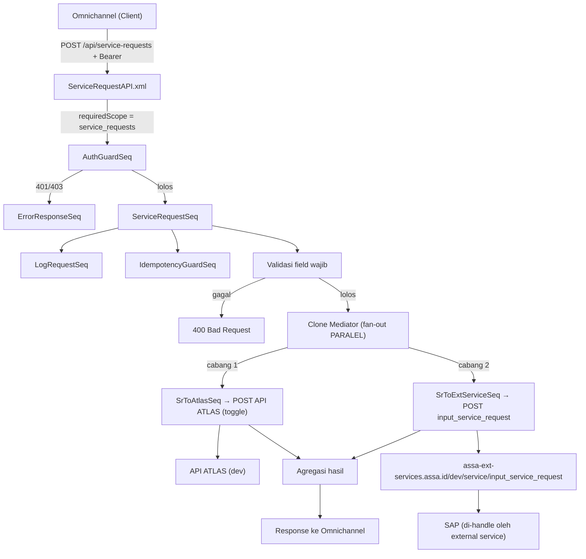

# API Guide — Service Request (SR) Fan-out Paralel
## ASSA Middleware — WSO2 Micro Integrator

> **Created By**: Nobi Sumariga

> **Created At**: 15 September 2026

> **Untuk**: Developer (assignment task)
> **Consumer**: Omnichannel
> **Tujuan**: Membangun endpoint `POST` pada middleware yang dikonsumsi **Omnichannel**, lalu **meneruskan request secara PARALEL** ke dua backend POST:
> 1. **API ATLAS** (endpoint masih dalam pengembangan tim ATLAS — dibuat configurable & dapat di-toggle).
> 2. **ASSA External Services**: `POST https://assa-ext-services.assa.id/dev/service/input_service_request` (backend ini yang meneruskan ke SAP).
>
> **Tidak ada pembuatan file XML.** Kedua target menerima POST langsung. Pembentukan payload SAP sudah ditangani oleh `input_service_request`.

---

## Daftar Isi
1. [Ringkasan Fitur](#1-ringkasan-fitur)
2. [Diagram Alur (Fan-out Paralel)](#2-diagram-alur-fan-out-paralel)
3. [Kontrak API Middleware (dari Omnichannel)](#3-kontrak-api-middleware-dari-omnichannel)
4. [Target Backend Paralel](#4-target-backend-paralel)
5. [Spesifikasi Field Body](#5-spesifikasi-field-body)
6. [Strategi Paralel & Agregasi Response](#6-strategi-paralel--agregasi-response)
7. [Kontrak Response](#7-kontrak-response)
8. [Konfigurasi yang Perlu Ditambahkan](#8-konfigurasi-yang-perlu-ditambahkan)
9. [SOP Implementasi (Langkah Developer)](#9-sop-implementasi-langkah-developer)
10. [Contoh Uji (curl)](#10-contoh-uji-curl)
11. [Checklist Acceptance](#11-checklist-acceptance)

---

## 1. Ringkasan Fitur

| Item | Nilai |
|---|---|
| **Nama fitur** | Service Request (SR) — Fan-out paralel ke ATLAS & ASSA External Services |
| **Method & Path (middleware)** | `POST /api/service-requests` |
| **Consumer** | Omnichannel |
| **Auth (Omnichannel → middleware)** | Wajib Bearer Token + scope `service_requests` (`AuthGuardSeq`) |
| **Target 1 (paralel)** | `POST` API ATLAS *(dalam pengembangan, configurable/toggle)* |
| **Target 2 (paralel)** | `POST https://assa-ext-services.assa.id/dev/service/input_service_request` (header `x-api-key`, body `x-www-form-urlencoded`) |
| **Pembuatan XML** | ❌ Tidak ada — kedua backend menerima POST langsung |
| **Alur ke SAP** | Melalui backend `input_service_request` (bukan dari middleware) |
| **Pola WSO2** | `Clone` mediator (fan-out) → 2 target sequence → agregasi |

---

## 2. Diagram Alur (Fan-out Paralel)



Reuse komponen existing: `AuthGuardSeq`, `LogRequestSeq`, `IdempotencyGuardSeq`, `ResolveBaseUrlSeq`, `ApiCallErrorHandlerSeq`, `DbRecordTransactionSeq`, `DbRecordAttemptLogSeq`, `ErrorResponseSeq`. Baru: **ServiceRequestAPI**, **ServiceRequestSeq** (orchestrator + Clone), **SrToAtlasSeq**, **SrToExtServiceSeq**, dan endpoint POST (`AtlasPostEndpoint`, `ExtServicePostEndpoint`).

---

## 3. Kontrak API Middleware (dari Omnichannel)

```
POST /api/service-requests
Host: {middleware-host}:8290
Authorization: Bearer <token>
Content-Type: application/json
X-Transaction-Id: <uuid opsional untuk idempotency>
```

### Contoh Request Body (JSON)

```json
{
  "app_id": "sr_app_id",
  "reff_number": "sr_reff_number",
  "branch_code": "sr_branch_code",
  "equipment_number": "sr_equipment_number",
  "license_plate": "sr_license_plate",
  "customer_code": "sr_customer_code",
  "customer_name": "sr_customer_name",
  "channel": "sr_channel",
  "cp_title": "sr_cp_title",
  "cp_name": "sr_cp_name",
  "cp_phone": "sr_cp_phone",
  "cp_email": "sr_cp_email",
  "cp_address": "sr_cp_address",
  "km": "sr_km",
  "description": "sr_description",
  "service_datetime": "sr_service_datetime",
  "service_location": "sr_service_location",
  "jenis_permintaan": "sr_jenis_permintaan",
  "incident_datetime": "sr_incident_datetime",
  "tipe_tiket": "sr_tipe_tiket",
  "judul": "sr_judul",
  "nama_kunjungan": "sr_nama_kunjungan",
  "telepon_kunjungan": "sr_telepon_kunjungan",
  "alamat_kunjungan": "sr_alamat_kunjungan",
  "pool_name": "sr_pool_name",
  "area_bengkel": "sr_area_bengkel",
  "task": "sr_task",
  "created_datetime": "12-12-2022",
  "created_by": "testing",
  "ticket_no": "test"
}
```

Middleware menerima JSON tunggal ini, lalu men-*fan-out* ke kedua target. Body yang dikirim ke masing-masing target dapat berbeda formatnya (lihat [Bagian 4](#4-target-backend-paralel)).

---

## 4. Target Backend Paralel

### Target 1 — API ATLAS (dalam pengembangan)
- Endpoint & kontrak **belum final** (tim ATLAS masih develop).
- Harus **configurable** (URL, path, header/auth) via `config.properties` / env.
- Harus punya **toggle** `sr.target.atlas.enabled` (default `false` sampai ATLAS siap) agar fitur bisa live lebih dulu dengan hanya target external service.
- Format body: **placeholder** — asumsikan JSON (samakan dengan payload masuk) sampai kontrak ATLAS final. Tandai `TODO` di kode.

### Target 2 — ASSA External Services (`input_service_request`)
```
POST https://assa-ext-services.assa.id/dev/service/input_service_request
Headers:
  x-api-key: <assa.ext.sr.apikey>
  Content-Type: application/x-www-form-urlencoded
Body (x-www-form-urlencoded): 30 field (lihat Bagian 5)
```
- Base URL DEV = `assa.ext.base.url.dev` (`https://assa-ext-services.assa.id/dev`, sudah ada di config).
- Path = `/service/input_service_request`.
- `x-api-key` di-resolve ENV → System → File (JANGAN hardcode di XML).
- Backend inilah yang meneruskan data ke SAP.

---

## 5. Spesifikasi Field Body

Untuk **Target 2** (external service) field dikirim sebagai `x-www-form-urlencoded` dengan nama parameter **persis** seperti kolom "Param Backend".

| No | Param Backend | Field JSON | Tipe | Wajib |
|---|---|---|---|---|
| 1 | `app_id` | `app_id` | string | Ya |
| 2 | `reff_number` | `reff_number` | string | Ya |
| 3 | `branch_code` | `branch_code` | string | Ya |
| 4 | `equipment_number` | `equipment_number` | string | Tidak |
| 5 | `license_plate` | `license_plate` | string | Tidak |
| 6 | `customer_code` | `customer_code` | string | Tidak |
| 7 | `customer_name` | `customer_name` | string | Tidak |
| 8 | `channel` | `channel` | string | Tidak |
| 9 | `cp_title` | `cp_title` | string | Tidak |
| 10 | `cp_name` | `cp_name` | string | Tidak |
| 11 | `cp_phone` | `cp_phone` | string | Tidak |
| 12 | `cp_email` | `cp_email` | string (email) | Tidak |
| 13 | `cp_address` | `cp_address` | string | Tidak |
| 14 | `km` | `km` | string/number | Tidak |
| 15 | `description` | `description` | string | Tidak |
| 16 | `service_datetime` | `service_datetime` | string (datetime) | Tidak |
| 17 | `service_location` | `service_location` | string | Tidak |
| 18 | `jenis_permintaan` | `jenis_permintaan` | string | Tidak |
| 19 | `incident_datetime` | `incident_datetime` | string (datetime) | Tidak |
| 20 | `tipe_tiket` | `tipe_tiket` | string | Tidak |
| 21 | `judul` | `judul` | string | Tidak |
| 22 | `nama_kunjungan` | `nama_kunjungan` | string | Tidak |
| 23 | `telepon_kunjungan` | `telepon_kunjungan` | string | Tidak |
| 24 | `alamat_kunjungan` | `alamat_kunjungan` | string | Tidak |
| 25 | `pool_name` | `pool_name` | string | Tidak |
| 26 | `area_bengkel` | `area_bengkel` | string | Tidak |
| 27 | `task` | `task` | string | Tidak |
| 28 | `created_datetime` | `created_datetime` | string (mis. `12-12-2022`) | Ya |
| 29 | `created_by` | `created_by` | string | Ya |
| 30 | `ticket_no` | `ticket_no` | string | Ya |

> **Wajib** di atas usulan minimal (`app_id`, `reff_number`, `branch_code`, `created_datetime`, `created_by`, `ticket_no`). **Konfirmasikan field wajib final dengan tim ASSA External Services.**
> **Encoding**: URL-encode setiap nilai saat menyusun form-urlencoded (spasi, `&`, `=`, non-ASCII).

---

## 6. Strategi Paralel & Agregasi Response

### Fan-out
Gunakan **`Clone` mediator** untuk mengeksekusi dua cabang **paralel**:
```xml
<clone>
  <target sequence="SrToAtlasSeq"/>
  <target sequence="SrToExtServiceSeq"/>
</clone>
```
Setiap cabang berjalan independen: punya endpoint POST sendiri, retry sendiri, dan pencatatan DB sendiri.

### Agregasi
- Gunakan **`Aggregate` mediator** untuk menunggu kedua cabang selesai lalu menggabungkan hasil.
- **Default policy (rekomendasi)**: **partial-success**. Middleware membalas `207` (multi-status style) memuat status per target. Kegagalan salah satu target **tidak** membatalkan target lainnya.
- Idempotency (`IdempotencyGuardSeq`) & logging dijalankan di orchestrator sebelum Clone, agar satu `transaction_id` mewakili keseluruhan request.

### Kegagalan parsial
| Skenario | Response |
|---|---|
| Kedua target sukses | `200 OK` |
| Salah satu gagal (setelah retry 3x) | `207` partial-success (detail per target) |
| Kedua target gagal | `502 Bad Gateway` |

> **Konfirmasi**: apakah bisnis menginginkan partial-success (`207`) atau *all-or-nothing*. Bila all-or-nothing dan tidak ada kompensasi/rollback di backend, itu sulit dijamin pada fan-out paralel — diskusikan. Dokumen ini memakai partial-success sebagai default aman.

---

## 7. Kontrak Response

### Kedua target sukses — `200 OK`
```json
{
  "success": true,
  "message": "Service request diteruskan ke semua target",
  "transactionId": "3f9ab2c1",
  "ticket_no": "test",
  "targets": {
    "atlas": { "status": "SUCCESS", "httpStatus": 200 },
    "extService": { "status": "SUCCESS", "httpStatus": 200 }
  }
}
```

### Partial success — `207`
```json
{
  "success": false,
  "message": "Sebagian target gagal",
  "transactionId": "3f9ab2c1",
  "targets": {
    "atlas": { "status": "FAILED", "httpStatus": 0, "detail": "ATLAS tidak dapat dihubungi" },
    "extService": { "status": "SUCCESS", "httpStatus": 200 }
  }
}
```

### Gagal validasi — `400 Bad Request`
```json
{ "error": true, "message": "Bad Request", "detail": "Field 'app_id' wajib diisi" }
```

### Kedua target gagal — `502 Bad Gateway`
```json
{ "error": true, "message": "Bad Gateway", "detail": "Semua target SR gagal setelah retry" }
```

### Duplikat — `409 Conflict` (dari IdempotencyGuardSeq)

---

## 8. Konfigurasi yang Perlu Ditambahkan

Tambahkan ke `src/main/wso2mi/resources/conf/config.properties`:

```properties
# ------------------------------------------------------------------------------
# Service Request (SR) — Fan-out ke ATLAS & ASSA External Services
# ------------------------------------------------------------------------------

# --- Target 2: ASSA External Services (DEV) ---
# Base URL dev sudah ada: assa.ext.base.url.dev=https://assa-ext-services.assa.id/dev
assa.api.path.service_request=/service/input_service_request
assa.ext.sr.apikey=DDtCZNeoPN27TWpHJdk9zaFwivxXrqQs2r1hbiKs   # pindahkan ke Secure Vault untuk produksi

# --- Target 1: API ATLAS (dalam pengembangan) ---
sr.target.atlas.enabled=false                 # toggle: aktifkan saat ATLAS siap
sr.target.atlas.base.url=https://atlas-api.assa.id/dev   # TODO: sesuaikan saat final
sr.target.atlas.path=/service-request         # TODO: sesuaikan saat final
sr.target.atlas.apikey=__USE_SECURE_VAULT__   # bila ATLAS pakai api key/token

# --- Toggle target external service (opsional) ---
sr.target.extservice.enabled=true

# App Registry: scope 'service_requests' untuk Omnichannel
# auth.app.app_omnichannel.token=__USE_SECURE_VAULT__
# auth.app.app_omnichannel.name=Omnichannel SR Consumer
# auth.app.app_omnichannel.scopes=service_requests
```

Environment override:
```
ASSA_EXT_BASE_URL, ASSA_EXT_SR_APIKEY, SR_TARGET_ATLAS_ENABLED, SR_TARGET_ATLAS_BASE_URL, SR_TARGET_ATLAS_APIKEY
```

---

## 9. SOP Implementasi (Langkah Developer)

### Langkah 1 — Daftarkan Omnichannel & scope `service_requests`
Tambahkan app Omnichannel pada App Registry dengan scope `service_requests`.

### Langkah 2 — Buat `ServiceRequestAPI.xml`
Lokasi: `src/main/wso2mi/artifacts/apis/ServiceRequestAPI.xml`
```xml
<?xml version="1.0" encoding="UTF-8"?>
<api context="/api/service-requests" name="ServiceRequestAPI" xmlns="http://ws.apache.org/ns/synapse">
    <resource methods="POST" uri-template="/">
        <inSequence>
            <property name="requiredScope" value="service_requests" scope="default" type="STRING"/>
            <sequence key="AuthGuardSeq"/>
            <sequence key="ServiceRequestSeq"/>
        </inSequence>
        <faultSequence>
            <sequence key="ErrorResponseSeq"/>
        </faultSequence>
    </resource>
</api>
```

### Langkah 3 — Buat endpoint POST
`ExtServicePostEndpoint.xml` dan `AtlasPostEndpoint.xml` (endpoint existing `ExtServiceDynamicEndpoint` hanya `GET`):
```xml
<endpoint name="ExtServicePostEndpoint" xmlns="http://ws.apache.org/ns/synapse">
    <http method="POST" uri-template="{+uri.var.extBackendUrl}">
        <timeout><duration>30000</duration><responseAction>fault</responseAction></timeout>
    </http>
</endpoint>
```
```xml
<endpoint name="AtlasPostEndpoint" xmlns="http://ws.apache.org/ns/synapse">
    <http method="POST" uri-template="{+uri.var.atlasBackendUrl}">
        <timeout><duration>30000</duration><responseAction>fault</responseAction></timeout>
    </http>
</endpoint>
```

### Langkah 4 — Buat orchestrator `ServiceRequestSeq.xml`
1. Ekstrak 30 field via `json-eval($.<field>)`, validasi field wajib. Gagal → `ErrorResponseSeq` + `<drop/>`.
2. `api.endpoint = /api/service-requests`, panggil `LogRequestSeq` & `IdempotencyGuardSeq`.
3. Simpan payload asli ke property agar tiap cabang bisa memakainya.
4. **Clone** ke dua cabang paralel:
   ```xml
   <clone>
       <target sequence="SrToExtServiceSeq"/>
       <target sequence="SrToAtlasSeq"/>
   </clone>
   ```
5. Gunakan `Aggregate` untuk menunggu & menggabungkan hasil, susun response ([Bagian 7](#7-kontrak-response)).

### Langkah 5 — Buat `SrToExtServiceSeq.xml` (Target 2)
1. Cek toggle `sr.target.extservice.enabled`; bila `false`, skip cabang.
2. Resolusi base URL:
   ```xml
   <property name="baseUrlConfigKey" value="assa.ext.base.url.dev"/>
   <property name="envVarKey" value="ASSA_EXT_BASE_URL"/>
   <sequence key="ResolveBaseUrlSeq"/>
   ```
3. Resolusi `x-api-key` (ENV → System → File `assa.ext.sr.apikey`), set header:
   ```xml
   <header name="Authorization" action="remove" scope="transport"/>
   <header name="x-api-key" expression="$ctx:srApiKey" scope="transport"/>
   ```
4. Susun URL: `uri.var.extBackendUrl = resolvedBaseUrl + assa.api.path.service_request`.
5. Bentuk body `x-www-form-urlencoded` dari 30 field (`payloadFactory` media-type `application/x-www-form-urlencoded`, nilai URL-encoded; set `messageType`/`ContentType`).
6. Kirim ke `ExtServicePostEndpoint` dibungkus `SafeApiCallWithRetrySeq` (retry 3x + DB log). Catat hasil ke property `extServiceStatus`.

### Langkah 6 — Buat `SrToAtlasSeq.xml` (Target 1)
1. Cek toggle `sr.target.atlas.enabled`; bila `false`, set status `SKIPPED` dan selesai (jangan hit ATLAS).
2. Bila `true`: resolusi `sr.target.atlas.base.url` + `sr.target.atlas.path`, set auth ATLAS (bila ada), susun body (JSON placeholder — **TODO** samakan dengan kontrak ATLAS final).
3. `uri.var.atlasBackendUrl = atlasBaseUrl + atlasPath`, kirim ke `AtlasPostEndpoint` dibungkus `SafeApiCallWithRetrySeq`. Catat hasil ke property `atlasStatus`.

### Langkah 7 — Build & uji
```powershell
mvn clean package
```
Uji dengan toggle ATLAS `false` dulu (hanya external service aktif), lalu `true` saat ATLAS siap.

> **Verifikasi dulu**: cek implementasi `SafeApiCallWithRetrySeq` — pastikan mendukung pemilihan endpoint via `targetEndpointKey` dan aman dipakai di dalam cabang `Clone`. Bila belum, panggil endpoint POST langsung di dalam cabang.

---

## 10. Contoh Uji (curl)

### Uji langsung ke Target 2 (verifikasi kredensial)
```bash
curl -X POST "https://assa-ext-services.assa.id/dev/service/input_service_request" \
  -H "x-api-key: DDtCZNeoPN27TWpHJdk9zaFwivxXrqQs2r1hbiKs" \
  -H "Content-Type: application/x-www-form-urlencoded" \
  --data-urlencode "app_id=sr_app_id" \
  --data-urlencode "reff_number=sr_reff_number" \
  --data-urlencode "branch_code=sr_branch_code" \
  --data-urlencode "created_datetime=12-12-2022" \
  --data-urlencode "created_by=testing" \
  --data-urlencode "ticket_no=test"
```

### Uji via middleware (fan-out)
```bash
curl -X POST "http://localhost:8290/api/service-requests" \
  -H "Authorization: Bearer <token>" \
  -H "Content-Type: application/json" \
  -d '{ "app_id":"sr_app_id", "reff_number":"sr_reff_number", "branch_code":"sr_branch_code", "created_datetime":"12-12-2022", "created_by":"testing", "ticket_no":"test" }'
```

---

## 11. Checklist Acceptance

- [ ] `POST /api/service-requests` menolak tanpa token (`401`) & tanpa scope `service_requests` (`403`).
- [ ] Field wajib divalidasi; kekurangan → `400` dengan `detail` jelas.
- [ ] Middleware men-*fan-out* PARALEL ke Target 2 (external service) & Target 1 (ATLAS) via `Clone`.
- [ ] Target 2: request POST menuju `.../dev/service/input_service_request` dengan `x-api-key` (di-resolve, bukan hardcode) & body `x-www-form-urlencoded` berisi 30 field.
- [ ] Header `Authorization` client dihapus sebelum call backend.
- [ ] Toggle `sr.target.atlas.enabled` berfungsi: `false` → ATLAS di-skip, hanya external service; `true` → keduanya dihit.
- [ ] Endpoint & kredensial ATLAS configurable (siap disesuaikan saat kontrak final).
- [ ] Agregasi menunggu kedua cabang; response mencerminkan status per target (`200` / `207` / `502`).
- [ ] Tiap cabang retry 3x independen; kegagalan tercatat di `api_transaction`/`api_transaction_log`.
- [ ] Idempotency berfungsi (replay `200`, in-flight `409`) — satu `transaction_id` untuk keseluruhan request.
- [ ] Tidak ada `x-api-key`/token plaintext yang di-commit (Secure Vault untuk produksi).
- [ ] Tidak ada pembuatan file XML (fitur ini murni HTTP fan-out).

---

## Catatan untuk Tim

1. **API ATLAS masih dikembangkan** — target ini dibuat toggle `sr.target.atlas.enabled=false` sebagai default. Aktifkan setelah tim ATLAS menyediakan endpoint & kontrak final. Body ATLAS saat ini placeholder (`TODO`).
2. **SAP** dicapai melalui backend `input_service_request`, bukan dihubungi langsung oleh middleware.
3. **Tidak ada XML/FTP** untuk fitur ini (beda dari fitur Vendor/SPK).
4. **Field wajib** final ditentukan backend ASSA External Services — konfirmasi.
5. **Kebijakan kegagalan** default = partial-success (`207`). Konfirmasi apakah bisnis butuh all-or-nothing.
6. `x-api-key` contoh sama dengan `assa.ext.vehicle.apikey.dev`; simpan sebagai key SR terpisah agar tidak tercampur.

---

*Dokumen assignment ini mengikuti pola arsitektur ASSA Middleware (lihat `STRUKTUR_ARSITEKTUR_LENGKAP.md`, `SOFTWARE_ARCHITECTURE_DOCUMENT.md`) dan pola external service existing (`VehicleGetByLicensePlateSeq`, `ExtServiceDynamicEndpoint`). Gunakan `Clone`/`Aggregate` untuk fan-out paralel, reuse sequence yang ada, hindari hardcoding base URL & API key.*
