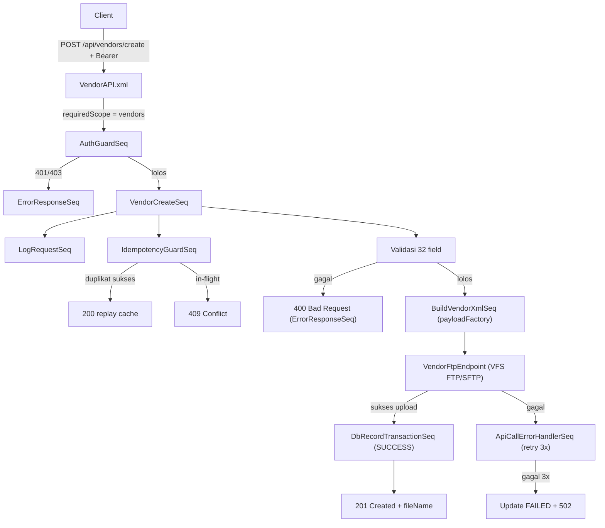

# API Guide — Vendor Create (XML → FTP)
## ASSA Middleware — WSO2 Micro Integrator

> **Created By**: Nobi Sumariga

> **Created At**: 15 September 2026

> **Untuk**: Developer (assignment task)
> **Tujuan**: Membangun endpoint baru yang menerima payload Vendor, **membentuk file XML**, lalu **mengirim file XML tersebut ke server FTP** (bukan pass-through langsung ke SAP Core). SAP akan mengambil file dari FTP untuk diproses lebih lanjut (interface berbasis file).

---

## Daftar Isi
1. [Ringkasan Fitur](#1-ringkasan-fitur)
2. [Kontrak API (Request)](#2-kontrak-api-request)
3. [Spesifikasi & Validasi Field](#3-spesifikasi--validasi-field)
4. [Struktur File XML Target](#4-struktur-file-xml-target)
5. [Aturan Penamaan File & Tujuan FTP](#5-aturan-penamaan-file--tujuan-ftp)
6. [Alur Proses (Flow)](#6-alur-proses-flow)
7. [Kontrak Response](#7-kontrak-response)
8. [Konfigurasi yang Perlu Ditambahkan](#8-konfigurasi-yang-perlu-ditambahkan)
9. [SOP Implementasi (Langkah Developer)](#9-sop-implementasi-langkah-developer)
10. [Checklist Acceptance](#10-checklist-acceptance)

---

## 1. Ringkasan Fitur

| Item | Nilai |
|---|---|
| **Nama fitur** | Vendor Create via File Interface |
| **Method & Path** | `POST /api/vendors/create` |
| **Auth** | Wajib Bearer Token + scope `vendors` (mengikuti `AuthGuardSeq`) |
| **Input** | JSON body berisi 32 field data Vendor |
| **Output artefak** | Satu file XML per request |
| **Tujuan pengiriman** | Server FTP (folder inbound SAP) |
| **Pola arsitektur** | Ikuti pola existing: API → AuthGuard → DomainSeq → (validasi) → BuildXML → FTP send → response |

Berbeda dengan API existing (Branch/Customer/Vehicle) yang melakukan HTTP call ke SAP Core, endpoint ini **menulis file XML dan mengunggahnya ke FTP** menggunakan VFS/FTP transport WSO2 MI.

---

## 2. Kontrak API (Request)

```
POST /api/vendors/create
Host: {middleware-host}:8290
Authorization: Bearer <token>
Content-Type: application/json
X-Transaction-Id: <uuid opsional untuk idempotency>
```

### Contoh Request Body

```json
{
  "companyCode": "1000",
  "purchasingOrganization": "1000",
  "accountGroup": "V010",
  "title": "PT",
  "name": "PT Sumber Makmur Sentosa",
  "street": "Jl. Raya Industri No. 12",
  "street2": "Blok A5",
  "street3": "",
  "street4": "",
  "street5": "",
  "postalCode": "40123",
  "city": "Bandung",
  "country": "ID",
  "mobilePhone": "081234567890",
  "email": "vendor@sumbermakmur.co.id",
  "vatRegNo": "012345678901234",
  "taxNumber5": "0123456789012345",
  "bankCountry": "ID",
  "bankKey": "0140099",
  "bankAccount": "1234567890",
  "accountHolder": "PT Sumber Makmur Sentosa",
  "contactFirstName": "Budi",
  "contactName": "Santoso",
  "contactTelephone": "0221234567",
  "reconAccount": "2121000000",
  "paymentTerms": "T030",
  "paymentMethods": ["Check", "Bank Transfer"],
  "whTaxCountry": "ID",
  "withholdingTaxType": ["V3"],
  "liable": true,
  "orderCurrency": "IDR",
  "salesPerson": "Andi Wijaya"
}
```

---

## 3. Spesifikasi & Validasi Field

Semua field wajib divalidasi di sequence sebelum XML dibentuk. Jika validasi gagal → kembalikan `400 Bad Request` via `ErrorResponseSeq` dengan `detail` yang jelas menyebut field mana yang salah.

| No | Field (JSON) | Label | Aturan Validasi | Wajib |
|---|---|---|---|---|
| 1 | `companyCode` | Company Code | Enum: `1000, 2000, 4000, 6000, 7000` | Ya |
| 2 | `purchasingOrganization` | Purchasing Organization | Enum: `1000, 4000, 6000, 7000` | Ya |
| 3 | `accountGroup` | Account Group | Enum kode: `V010` (Vendor Unit), `V020` (Vendor Non Unit), `V030` (Vendor Cabang) | Ya |
| 4 | `title` | Title | Enum: `CV, BUT, Company, KOPERASI, PD, PT, UD, YAYASAN` | Ya |
| 5 | `name` | Name | String, max 80 char | Ya |
| 6 | `street` | Street | String, max 60 char | Ya |
| 7 | `street2` | Street 2 | String, max 40 char | Tidak |
| 8 | `street3` | Street 3 | String, max 40 char | Tidak |
| 9 | `street4` | Street 4 | String, max 40 char | Tidak |
| 10 | `street5` | Street 5 | String, max 40 char | Tidak |
| 11 | `postalCode` | Postal Code | String, max 10 char | Ya |
| 12 | `city` | City | String, max 40 char | Ya |
| 13 | `country` | Country | Fixed value `ID` | Ya |
| 14 | `mobilePhone` | Mobile Phone | String, max 30 char | Tidak |
| 15 | `email` | E-Mail | String, max 241 char, format email valid | Tidak |
| 16 | `vatRegNo` | VAT Reg. No. (NPWP 15) | String, max 20 char | Tidak |
| 17 | `taxNumber5` | Tax Number 5 (NPWP 16) | String, max 60 char | Tidak |
| 18 | `bankCountry` | Bank Details - Ctry | Fixed value `ID` | Kondisional* |
| 19 | `bankKey` | Bank Key | String, max 15 char | Kondisional* |
| 20 | `bankAccount` | Bank Account | String, max 18 char | Kondisional* |
| 21 | `accountHolder` | Account Holder | String, max 60 char | Kondisional* |
| 22 | `contactFirstName` | Contact Person - First Name | String, max 35 char | Tidak |
| 23 | `contactName` | Contact Person - Name | String, max 35 char | Tidak |
| 24 | `contactTelephone` | Contact Person - Telephone | String, max 16 char | Tidak |
| 25 | `reconAccount` | Recon Account | Enum kode GL (lihat [Lampiran A](#lampiran-a--recon-account)) | Ya |
| 26 | `paymentTerms` | Payment Terms | Enum kode `T000`–`T120` (lihat [Lampiran B](#lampiran-b--payment-terms)) | Ya |
| 27 | `paymentMethods` | Payment Methods | Array/multi-select dari: `Check, Cash Payment, Leasing, Bank Transfer` | Tidak |
| 28 | `whTaxCountry` | WH Tax Country | Fixed value `ID` | Kondisional** |
| 29 | `withholdingTaxType` | Withholding Tax Type | Array kode: `F1, F2, F3, V1, V2, V3, V4, V5` (lihat [Lampiran C](#lampiran-c--withholding-tax-type)) | Kondisional** |
| 30 | `liable` | Liable | Boolean (`true`/`false`) | Tidak |
| 31 | `orderCurrency` | Order Currency | Fixed value `IDR` | Ya |
| 32 | `salesPerson` | Sales Person | String, max 30 char | Tidak |

> **\* Bank details (18–21)**: bila salah satu diisi maka `bankKey`, `bankAccount`, `accountHolder` wajib diisi bersama, dan `bankCountry` = `ID`.
> **\*\* Withholding tax (28–29)**: bila `withholdingTaxType` diisi, `whTaxCountry` wajib `ID`.

### Aturan validasi umum
- Trim whitespace di setiap field string sebelum cek panjang.
- Field enum: bandingkan **kode** (mis. `V010`, `T030`, `V3`), bukan deskripsi.
- Field dengan nilai fixed (`country`, `bankCountry`, `whTaxCountry`, `orderCurrency`): tolak bila bukan nilai yang ditentukan.
- Panjang string melebihi batas → `400 Bad Request` (jangan auto-truncate).

---

## 4. Struktur File XML Target

XML dibentuk dari payload. Gunakan `<payloadFactory>` (media-type `xml`) atau XSLT. Struktur usulan (sesuaikan tag dengan spesifikasi interface SAP bila ada; ini template dasar):

```xml
<?xml version="1.0" encoding="UTF-8"?>
<VendorCreate>
  <Header>
    <TransactionId>{X-Transaction-Id}</TransactionId>
    <CorrelationId>{X-Correlation-Id}</CorrelationId>
    <CreatedAt>{ISO-8601 timestamp}</CreatedAt>
    <Source>ASSA-MIDDLEWARE</Source>
  </Header>
  <Vendor>
    <CompanyCode>1000</CompanyCode>
    <PurchasingOrganization>1000</PurchasingOrganization>
    <AccountGroup>V010</AccountGroup>
    <Title>PT</Title>
    <Name>PT Sumber Makmur Sentosa</Name>
    <Address>
      <Street>Jl. Raya Industri No. 12</Street>
      <Street2>Blok A5</Street2>
      <Street3/>
      <Street4/>
      <Street5/>
      <PostalCode>40123</PostalCode>
      <City>Bandung</City>
      <Country>ID</Country>
    </Address>
    <Contact>
      <MobilePhone>081234567890</MobilePhone>
      <Email>vendor@sumbermakmur.co.id</Email>
      <FirstName>Budi</FirstName>
      <Name>Santoso</Name>
      <Telephone>0221234567</Telephone>
    </Contact>
    <Tax>
      <VatRegNo>012345678901234</VatRegNo>
      <TaxNumber5>0123456789012345</TaxNumber5>
      <WhTaxCountry>ID</WhTaxCountry>
      <WithholdingTaxTypes>
        <Type>V3</Type>
      </WithholdingTaxTypes>
      <Liable>true</Liable>
    </Tax>
    <Bank>
      <Country>ID</Country>
      <BankKey>0140099</BankKey>
      <Account>1234567890</Account>
      <AccountHolder>PT Sumber Makmur Sentosa</AccountHolder>
    </Bank>
    <Payment>
      <ReconAccount>2121000000</ReconAccount>
      <Terms>T030</Terms>
      <Methods>
        <Method>Check</Method>
        <Method>Bank Transfer</Method>
      </Methods>
      <OrderCurrency>IDR</OrderCurrency>
    </Payment>
    <SalesPerson>Andi Wijaya</SalesPerson>
  </Vendor>
</VendorCreate>
```

> **Catatan encoding**: escape karakter khusus (`&`, `<`, `>`) saat menyusun XML. Bila memakai `payloadFactory`, gunakan argumen berparameter (`<args>` + `expression`) agar escaping otomatis dan aman dari XML injection.

---

## 5. Aturan Penamaan File & Tujuan FTP

### Nama file
Format: `VENDOR_{companyCode}_{transactionId}_{yyyyMMddHHmmss}.xml`

Contoh: `VENDOR_1000_3f9ab2c1_20260915103245.xml`

- `transactionId` diambil dari `X-Transaction-Id`; bila tidak dikirim client, generate UUID.
- Timestamp memakai zona `Asia/Jakarta`.

### Tujuan FTP
File diunggah ke folder inbound SAP di server FTP. Detail koneksi **tidak di-hardcode di XML** — simpan di `config.properties` / environment variable, konsisten dengan prinsip proyek.

Gunakan **VFS transport** WSO2 MI. Skema URI VFS FTP:

```
vfs:ftp://<user>:<pass>@<host>:<port>/<remote-dir>?vfs.passive=true
```

Rekomendasi: pakai **staging + rename** agar SAP tidak membaca file setengah tertulis:
1. Tulis ke nama sementara (mis. `*.tmp` atau folder `.staging/`).
2. Setelah selesai, rename ke nama final `.xml` (atomic move di sisi FTP bila didukung).

> **Keamanan**: prefer **SFTP/FTPS** bila server mendukung. Kredensial FTP wajib lewat Secure Vault / secret manager, bukan plaintext yang di-commit.

---

## 6. Alur Proses (Flow)



Reuse maksimal dari komponen existing: `AuthGuardSeq`, `LogRequestSeq`, `IdempotencyGuardSeq`, `ApiCallErrorHandlerSeq`, `DbRecordTransactionSeq`, `DbRecordAttemptLogSeq`, `ErrorResponseSeq`. Yang baru hanya: **VendorAPI**, **VendorCreateSeq**, **BuildVendorXmlSeq** (opsional, bisa inline), dan **VendorFtpEndpoint**.

---

## 7. Kontrak Response

### Sukses — `201 Created`
```json
{
  "success": true,
  "message": "Vendor payload accepted and delivered to FTP",
  "transactionId": "3f9ab2c1",
  "fileName": "VENDOR_1000_3f9ab2c1_20260915103245.xml",
  "correlationId": "corr-20260915..."
}
```

### Gagal validasi — `400 Bad Request`
```json
{
  "error": true,
  "message": "Bad Request",
  "detail": "Field 'name' melebihi 80 karakter"
}
```

### Gagal kirim FTP setelah retry — `502 Bad Gateway`
```json
{
  "error": true,
  "message": "Bad Gateway",
  "detail": "Gagal mengirim file ke FTP setelah 3x percobaan"
}
```

### Duplikat — `409 Conflict` (dari IdempotencyGuardSeq)

---

## 8. Konfigurasi yang Perlu Ditambahkan

Tambahkan ke `src/main/wso2mi/resources/conf/config.properties` (nilai contoh, sesuaikan; kredensial pakai Secure Vault):

```properties
# ------------------------------------------------------------------------------
# Vendor Create — FTP Interface
# ------------------------------------------------------------------------------
ftp.vendor.host=ftp.internal.assa.id
ftp.vendor.port=21
ftp.vendor.username=svc_vendor
ftp.vendor.password=__USE_SECURE_VAULT__
ftp.vendor.remote.dir=/inbound/vendor
ftp.vendor.staging.dir=/inbound/vendor/.staging
ftp.vendor.passive=true
ftp.vendor.protocol=ftp   # ftp | sftp | ftps

# App Registry: tambahkan scope 'vendors' bagi aplikasi yang berhak
# auth.app.app_a.scopes=branches,customers,vehicles,vendors
```

Override environment (untuk docker-compose / K8s):
```
FTP_VENDOR_HOST, FTP_VENDOR_PORT, FTP_VENDOR_USERNAME, FTP_VENDOR_PASSWORD, FTP_VENDOR_REMOTE_DIR
```

Aktifkan **VFS transport** di `deployment/deployment.toml`:
```toml
[transport.vfs]
listener_enable = true
sender_enable = true
```

---

## 9. SOP Implementasi (Langkah Developer)

### Langkah 1 — Daftarkan scope `vendors`
Edit `config.properties`, tambahkan `vendors` pada `auth.app.<appId>.scopes` untuk aplikasi yang berhak.

### Langkah 2 — Buat `VendorAPI.xml`
Lokasi: `src/main/wso2mi/artifacts/apis/VendorAPI.xml`
```xml
<?xml version="1.0" encoding="UTF-8"?>
<api context="/api/vendors" name="VendorAPI" xmlns="http://ws.apache.org/ns/synapse">
    <resource methods="POST" uri-template="/create">
        <inSequence>
            <property name="requiredScope" value="vendors" scope="default" type="STRING"/>
            <sequence key="AuthGuardSeq"/>
            <sequence key="VendorCreateSeq"/>
        </inSequence>
        <faultSequence>
            <sequence key="ErrorResponseSeq"/>
        </faultSequence>
    </resource>
</api>
```

### Langkah 3 — Buat `VendorFtpEndpoint.xml`
Lokasi: `src/main/wso2mi/artifacts/endpoints/VendorFtpEndpoint.xml`. Gunakan address endpoint dengan format VFS yang URL-nya diisi dinamis dari `config.properties` (mengikuti pola `ResolveBaseUrl` untuk membangun `uri.var.*`). Set `format="xml"`.

### Langkah 4 — Buat `VendorCreateSeq.xml`
Lokasi: `src/main/wso2mi/artifacts/sequences/VendorCreateSeq.xml`. Isi:
1. Ekstrak field dari JSON body (`json-eval($.<field>)`).
2. Validasi seluruh field sesuai [Bagian 3](#3-spesifikasi--validasi-field). Bila gagal set `errorCode`/`errorMessage` lalu panggil `ErrorResponseSeq`.
3. Set `api.endpoint = /api/vendors/create`, panggil `LogRequestSeq` & `IdempotencyGuardSeq`.
4. Bentuk XML via `payloadFactory` (argumen berparameter untuk escaping aman) → lihat [Bagian 4](#4-struktur-file-xml-target).
5. Set nama file & properti VFS (`transport.vfs.ReplyFileName`), lalu kirim ke `VendorFtpEndpoint` dibungkus `SafeApiCallWithRetrySeq` agar dapat retry 3x + logging DB.
6. Pada sukses: `DbRecordTransactionSeq` status `SUCCESS`, balas `201`.

### Langkah 5 — Build & uji
```powershell
mvn clean package
```
Jalankan container/server, lalu uji dengan `curl`/Postman (lihat contoh request di [Bagian 2](#2-kontrak-api-request)) dan verifikasi file muncul di folder FTP.

---

## 10. Checklist Acceptance

- [ ] `POST /api/vendors/create` menolak request tanpa token (`401`) dan tanpa scope `vendors` (`403`).
- [ ] Semua 32 field tervalidasi sesuai aturan (enum, panjang, fixed value, kondisional bank & WHT).
- [ ] Panjang string melebihi batas ditolak `400` (tanpa truncate).
- [ ] File XML terbentuk dengan struktur benar & karakter khusus ter-escape.
- [ ] File terkirim ke folder FTP dengan pola nama `VENDOR_{companyCode}_{transactionId}_{timestamp}.xml`.
- [ ] Pakai staging + rename agar SAP tidak baca file parsial.
- [ ] Kegagalan FTP memicu retry 3x lalu `502`, transaksi tercatat `FAILED` di `api_transaction`.
- [ ] Idempotency berfungsi (replay `200`, in-flight `409`).
- [ ] Tidak ada kredensial FTP plaintext yang di-commit (pakai Secure Vault / env).
- [ ] Response sukses `201` memuat `transactionId` & `fileName`.

---

## Lampiran

### Lampiran A — Recon Account
| Kode | Deskripsi |
|---|---|
| 1162000001 | UANG MUKA - SPD |
| 1162000002 | UANG MUKA - GAJI KARYAWAN |
| 1162000003 | UANG MUKA OPERASIONAL LOGISTIK |
| 1162000004 | UANG MUKA AP CENTRAL |
| 1162000005 | UANG MUKA GAJI (DRIVER MITRA) |
| 1162000006 | UANG MUKA BBN, STNK, KIR DAN SURAT KEND LAIN |
| 1162000007 | UANG MUKA ASURANSI |
| 1162999999 | UANG MUKA - LAINNYA |
| 1260000000 | UANG MUKA PEMBELIAN ASET |
| 2111000000 | HUTANG JANGKA PENDEK (SHORT TERM LOAN) |
| 2112000000 | HUTANG PROMES |
| 2121000000 | HUTANG USAHA P.KETIGA |
| 2122000000 | HUTANG USAHA P.BERELASI |
| 2131000001 | HUTANG LAIN-LAIN P.KETIGA |
| 2132000000 | HUTANG LAIN-LAIN P.BERELASI |
| 2181000000 | HUTANG BANK JANGKA PENDEK |
| 2181000001 | HUTANG LEASING JANGKA PENDEK |
| 2182000000 | HUTANG LAINNYA JANGKA PENDEK |
| 2182000003 | Hutang STL SCF AP FINANCING |
| 2211000000 | HUTANG BANK JANGKA PANJANG |
| 2211000001 | HUTANG LEASING JANGKA PANJANG |
| 2212000000 | HUTANG LAINNYA JANGKA PANJANG |
| 9200000000 | HUTANG ANTAR CABANG |

### Lampiran B — Payment Terms
| Kode | Deskripsi |
|---|---|
| T000 | Terms of Payment 0 days |
| T003 | Terms of Payment 3 days |
| T007 | Terms of Payment 7 days |
| T014 | Terms of Payment 14 days |
| T021 | Terms of Payment 21 days |
| T030 | Terms of Payment 30 days |
| T045 | Terms of Payment 45 days |
| T060 | Terms of Payment 60 days |
| T075 | Terms of Payment 75 days |
| T090 | Terms of Payment 90 days |
| T105 | Terms of Payment 105 days |
| T120 | Terms of Payment 120 days |

### Lampiran C — Withholding Tax Type
| Kode | Deskripsi |
|---|---|
| F1 | 21-Imbalan non Pgw tdk lnjut |
| F2 | 23-Jasa |
| F3 | 4(2)-Penghasilan Tertentu Lainnya |
| V1 | Vendor Wht Type - Pasal 4(2) |
| V2 | Vendor Wht Type - Pasal 21 Non Karyawan |
| V3 | Vendor Wht Type - Pasal 23 |
| V4 | Vendor Wht Type - Pasal 26 |
| V5 | Vendor Wht Type - Pasal 21 Final |

### Lampiran D — Payment Methods
Multi-select checkbox: `Check`, `Cash Payment`, `Leasing`, `Bank Transfer`. Dikirim sebagai array string di JSON, dipetakan ke elemen `<Method>` berulang di XML.

---

*Dokumen assignment ini mengikuti pola arsitektur ASSA Middleware (lihat `STRUKTUR_ARSITEKTUR_LENGKAP.md` dan `SOFTWARE_ARCHITECTURE_DOCUMENT.md`). Reuse sequence yang ada dan hindari hardcoding konfigurasi.*
