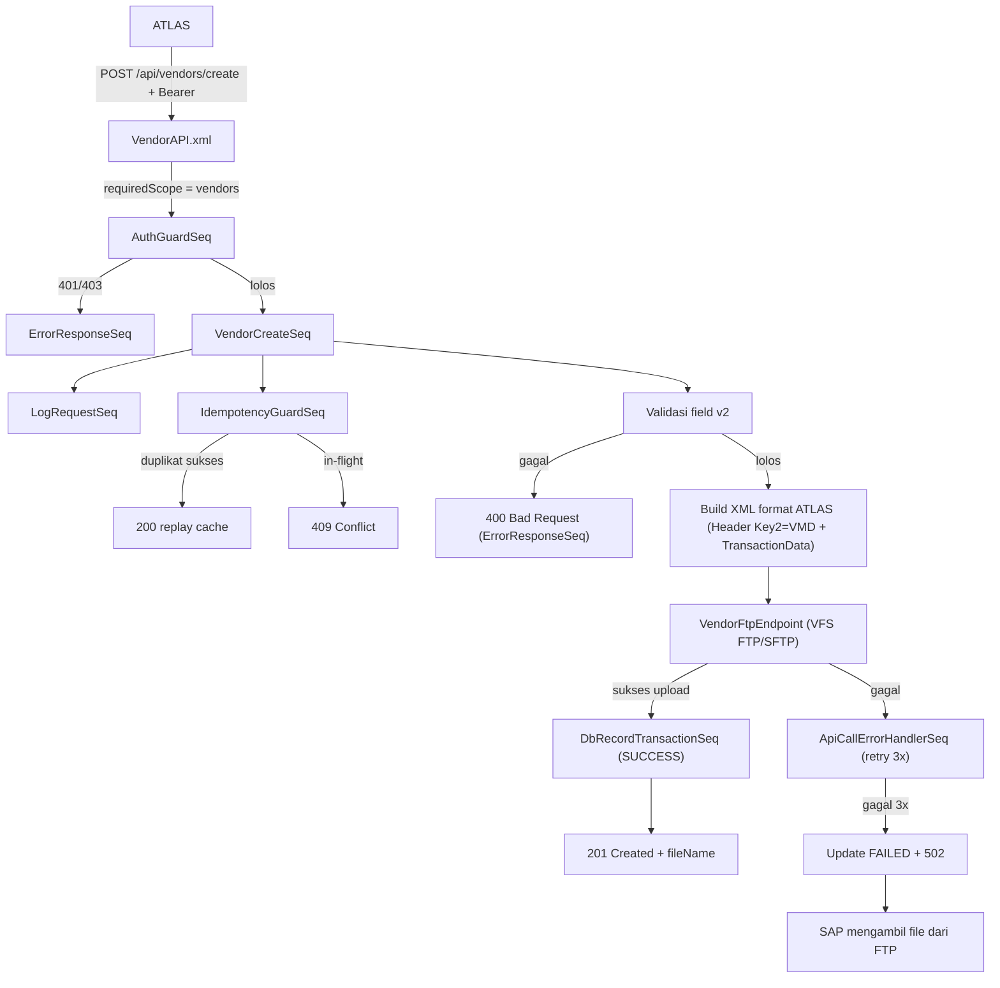

# API Guide — Vendor Create / VMD (XML → FTP) — **Version 2**
## ASSA Middleware — WSO2 Micro Integrator

> **Created By**: Nobi Sumariga

> **Created At**: 16 September 2026

> **Untuk**: Developer (assignment task)
> **Alur**: `ATLAS → Middleware → XML → FTP → SAP`
> **Perubahan v2**: Penyesuaian daftar field mengikuti kebutuhan terbaru dan **format XML resmi ATLAS/SAP** (`Transaction` → `Header` + `TransactionDatas`). Menggantikan struktur XML pada v1 (`GUIDE_VENDOR_CREATE_XML_FTP.md`).
> **Referensi format**: `ref/VMD_000001.xml`

---

## Daftar Isi
1. [Ringkasan Fitur](#1-ringkasan-fitur)
2. [Perubahan dari V1](#2-perubahan-dari-v1)
3. [Kontrak API (Request)](#3-kontrak-api-request)
4. [Spesifikasi & Validasi Field](#4-spesifikasi--validasi-field)
5. [Struktur File XML Target (Format ATLAS)](#5-struktur-file-xml-target-format-atlas)
6. [Pemetaan Field JSON → XML](#6-pemetaan-field-json--xml)
7. [Aturan Penamaan File & Tujuan FTP](#7-aturan-penamaan-file--tujuan-ftp)
8. [Alur Proses (Flow)](#8-alur-proses-flow)
9. [Kontrak Response](#9-kontrak-response)
10. [Konfigurasi yang Perlu Ditambahkan](#10-konfigurasi-yang-perlu-ditambahkan)
11. [SOP Implementasi (Langkah Developer)](#11-sop-implementasi-langkah-developer)
12. [Checklist Acceptance](#12-checklist-acceptance)

---

## 1. Ringkasan Fitur

| Item | Nilai |
|---|---|
| **Nama fitur** | Vendor Master Data (VMD) Create via File Interface |
| **Method & Path** | `POST /api/vendors/create` |
| **Auth** | Wajib Bearer Token + scope `vendors` (`AuthGuardSeq`) |
| **Consumer** | ATLAS |
| **Input** | JSON body berisi field Vendor (v2) |
| **Output artefak** | Satu file XML format ATLAS (`Key2 = VMD`) |
| **Tujuan pengiriman** | Server FTP (folder inbound SAP) |
| **Alur** | ATLAS → Middleware → bentuk XML → FTP → SAP mengambil file |

---

## 2. Perubahan dari V1

| Aspek | V1 | V2 (dokumen ini) |
|---|---|---|
| Jumlah field input | 32 field detail | Disederhanakan sesuai kebutuhan ATLAS (lihat [Bagian 4](#4-spesifikasi--validasi-field)) |
| Field baru | — | `OTV (One Time Vendor)`, `Payment Cycle` |
| Struktur XML | `<VendorCreate>` custom | **Format ATLAS resmi**: `<Transaction><Header/><TransactionDatas/></Transaction>` |
| Title | Enum 8 nilai | Dipersempit ke `PT` / `CV` |
| Header XML | Tidak ada | Wajib blok `<Header>` dengan `ID=ATLAS`, `Key2=VMD`, dll. |

---

## 3. Kontrak API (Request)

```
POST /api/vendors/create
Host: {middleware-host}:8290
Authorization: Bearer <token>
Content-Type: application/json
X-Transaction-Id: <uuid opsional untuk idempotency>
X-Forwarded-For: <IP pengirim, dipakai untuk Header/IPAddress>
```

### Contoh Request Body (V2)

```json
{
  "companyTitle": "PT",
  "companyName": "PT Adi Sarana Armada Tbk",
  "otv": "No",
  "paymentCycle": "Monthly",
  "accountNumber": "1200010978489",
  "accountName": "Robby Yulianto Setiawan",
  "bankName": "Mandiri",
  "hoEmail": "assa@assarent.co.id",
  "hoPhone": "082246605199",
  "hoAddress": "Jalan Nusa Indah 2 Block C.ext 8 no 7, Duri Kosambi, Jakarta Barat, DKI Jakarta, 11410",
  "contactName": "Robby Contact",
  "contactPhone": "08224660189",
  "npwp": "3173080209920003",
  "accountGroup": "V010",
  "top": "T014",
  "glAccount": "2121000000",
  "documentNumber": "VENDOR-ATLAS-000123"
}
```

> **Catatan**: `accountGroup`, `top`, dan `glAccount` muncul pada contoh XML `VMD_000001.xml` sehingga disertakan di sini. `documentNumber` mengisi `<Header><DocumentNumber>` (vendor_id ATLAS).

---

## 4. Spesifikasi & Validasi Field

Validasi dilakukan di sequence sebelum XML dibentuk. Gagal → `400 Bad Request` via `ErrorResponseSeq`.

### 4.1 Field Utama (dari daftar penyesuaian v2)

| No | Field (JSON) | Label | Aturan Validasi | Wajib |
|---|---|---|---|---|
| 1 | `companyTitle` | Company Title | Enum: `PT`, `CV` | Ya |
| 2 | `companyName` | Company Name | Free text, disarankan max 80 char | Ya |
| 3 | `otv` | OTV (One Time Vendor) | Enum: `Yes`, `No` | Ya |
| 4 | `paymentCycle` | Payment Cycle | Enum: `Daily`, `Weekly`, `Monthly` | Ya |
| 5 | `accountNumber` | Account Number | Free text (nomor rekening), max 18 char | Kondisional* |
| 6 | `accountName` | Account Name | Free text, max 60 char | Kondisional* |
| 7 | `bankName` | Bank Name | Free text, max 40 char | Kondisional* |
| 8 | `hoEmail` | Head Office - Official Email | Format email valid, max 241 char | Ya |
| 9 | `hoPhone` | Head Office - Official Phone | Free text, max 30 char | Ya |
| 10 | `hoAddress` | Head Office - Address | Free text, max 241 char | Ya |
| 11 | `contactName` | Contact Name | Free text, max 35 char | Tidak |
| 12 | `contactPhone` | Contact Phone | Free text, max 16 char | Tidak |
| 13 | `npwp` | NPWP Document Number | Free text (15/16 digit NPWP), max 20 char | Ya |

> **\* Bank details (5–7)**: jika `otv = No`, ketiga field bank (`accountNumber`, `accountName`, `bankName`) wajib diisi. Jika `otv = Yes` (One Time Vendor), field bank boleh kosong. Konfirmasikan aturan final dengan tim SAP.

### 4.2 Field Tambahan (muncul di XML ATLAS)

| No | Field (JSON) | Label | Aturan Validasi | Wajib |
|---|---|---|---|---|
| 14 | `accountGroup` | Account Group | Enum kode: `V010` (Vendor Unit), `V020` (Vendor Non Unit), `V030` (Vendor Cabang) | Ya |
| 15 | `top` | TOP / Payment Terms | Kode payment terms (mis. `T014`). Di XML ditulis `T014 - 14 Hari` | Ya |
| 16 | `glAccount` | GL Account | Kode GL account SAP (mis. `2121000000`) | Ya |
| 17 | `documentNumber` | Document Number | Vendor ID dari ATLAS → `<Header><DocumentNumber>` | Ya |

### 4.3 Aturan validasi umum
- Trim whitespace pada field string sebelum cek panjang.
- Field enum: bandingkan **kode/nilai** (mis. `PT`, `V010`, `Monthly`), case-sensitive sesuai kesepakatan.
- `hoEmail`: validasi format email.
- Panjang melebihi batas → `400` (jangan auto-truncate).

---

## 5. Struktur File XML Target (Format ATLAS)

XML **wajib** mengikuti format resmi ATLAS berikut (referensi `ref/VMD_000001.xml`). Blok `<Header>` bersifat standar untuk semua interface ATLAS; yang membedakan VMD adalah `Key2 = VMD`.

```xml
<?xml version="1.0" encoding="UTF-8"?>
<Transaction>
	<Header>
		<ID>ATLAS</ID>
		<TransGuID>2026-09-16 14:46:11-VMD</TransGuID>
		<DocumentNumber>VENDOR-ATLAS-000123</DocumentNumber>
		<FileType>XML</FileType>
		<IPAddress>10.20.30.40</IPAddress>
		<DestinationUser>SAP</DestinationUser>
		<Key1>ATLAS</Key1>
		<Key2>VMD</Key2>
		<DataLength>1</DataLength>
	</Header>
	<TransactionDatas>
		<TransactionData>
			<Company_title>PT</Company_title>
			<Company_Name>PT Adi Sarana Armada Tbk</Company_Name>
			<OTV>No</OTV>
			<Account_Number>1200010978489</Account_Number>
			<Account_Name>Robby Yulianto Setiawan</Account_Name>
			<Bank_Name>Mandiri</Bank_Name>
			<HO_Email>assa@assarent.co.id</HO_Email>
			<HO_Phone>082246605199</HO_Phone>
			<HO_Address>Jalan Nusa Indah 2 Block C.ext 8 no 7, Duri Kosambi, Jakarta Barat, DKI Jakarta, 11410</HO_Address>
			<Contact_Name>Robby Contact</Contact_Name>
			<Contact_Phone>08224660189</Contact_Phone>
			<NPWP>3173080209920003</NPWP>
			<TOP>T014 - 14 Hari</TOP>
			<Account_Group>V010</Account_Group>
			<GL_Account>2121000000</GL_Account>
		</TransactionData>
	</TransactionDatas>
</Transaction>
```

### Aturan pengisian Header

| Tag Header | Nilai | Sumber |
|---|---|---|
| `ID` | `ATLAS` | Konstanta |
| `TransGuID` | `{yyyy-MM-dd HH:mm:ss}-VMD` | Timestamp server (Asia/Jakarta) + suffix `-VMD` |
| `DocumentNumber` | Vendor ID ATLAS | Field `documentNumber` |
| `FileType` | `XML` | Konstanta |
| `IPAddress` | IP pengirim | Header `X-Forwarded-For` / remote address |
| `DestinationUser` | `SAP` | Konstanta |
| `Key1` | `ATLAS` | Konstanta |
| `Key2` | `VMD` | Konstanta (penanda interface Vendor Master Data) |
| `DataLength` | `1` | Jumlah `<TransactionData>` (VMD = 1 per file) |

> **Encoding**: escape karakter khusus (`&`, `<`, `>`). Field seperti `HO_Address` sering mengandung koma/karakter khusus — gunakan argumen berparameter `payloadFactory` agar escaping aman dari XML injection.
>
> **TOP di XML**: nilai ditulis sebagai `{kode} - {deskripsi}` (mis. `T014 - 14 Hari`). Middleware menyusun string ini dari kode `top` + tabel deskripsi payment terms.

---

## 6. Pemetaan Field JSON → XML

| Field JSON | Tag XML | Keterangan |
|---|---|---|
| `companyTitle` | `<Company_title>` | `PT` / `CV` |
| `companyName` | `<Company_Name>` | Free text |
| `otv` | `<OTV>` | `Yes` / `No` |
| `accountNumber` | `<Account_Number>` | |
| `accountName` | `<Account_Name>` | |
| `bankName` | `<Bank_Name>` | |
| `hoEmail` | `<HO_Email>` | |
| `hoPhone` | `<HO_Phone>` | |
| `hoAddress` | `<HO_Address>` | |
| `contactName` | `<Contact_Name>` | |
| `contactPhone` | `<Contact_Phone>` | |
| `npwp` | `<NPWP>` | |
| `top` | `<TOP>` | Format `kode - deskripsi` |
| `accountGroup` | `<Account_Group>` | `V010`/`V020`/`V030` |
| `glAccount` | `<GL_Account>` | |
| `documentNumber` | `<Header><DocumentNumber>` | Vendor ID ATLAS |
| `paymentCycle` | *(lihat catatan)* | **Belum ada tag di contoh XML** — perlu konfirmasi |

> ⚠️ **Perlu konfirmasi**: field **`Payment Cycle`** ada di daftar penyesuaian v2 tetapi **tidak muncul** di contoh `VMD_000001.xml`. Tanyakan ke tim SAP/ATLAS apakah perlu tag baru (mis. `<Payment_Cycle>`) atau field ini hanya dipakai internal middleware. Jangan tambahkan tag ke XML sebelum dikonfirmasi agar tidak ditolak parser SAP.

---

## 7. Aturan Penamaan File & Tujuan FTP

### Nama file
Ikuti konvensi ATLAS pada referensi (`VMD_000001.xml`):

Format: `VMD_{sequence6digit}.xml` — contoh: `VMD_000001.xml`

Alternatif dengan transaction id (bila diperlukan keunikan lintas node): `VMD_{yyyyMMddHHmmss}_{transactionId}.xml`. **Konfirmasikan konvensi final dengan tim SAP** karena penamaan file sering menjadi kontrak interface.

### Tujuan FTP
Gunakan **VFS transport** WSO2 MI. Detail koneksi FTP **tidak di-hardcode** — simpan di `config.properties` / environment variable.

```
vfs:ftp://<user>:<pass>@<host>:<port>/<remote-dir>?vfs.passive=true
```

Gunakan **staging + rename** agar SAP tidak membaca file setengah tertulis:
1. Tulis ke folder/nama sementara (`.staging/` atau `*.tmp`).
2. Setelah selesai, rename ke nama final `.xml`.

> **Keamanan**: prefer **SFTP/FTPS**. Kredensial FTP lewat Secure Vault / secret manager, jangan plaintext.

---

## 8. Alur Proses (Flow)



Reuse komponen existing: `AuthGuardSeq`, `LogRequestSeq`, `IdempotencyGuardSeq`, `SafeApiCallWithRetrySeq`, `ApiCallErrorHandlerSeq`, `DbRecordTransactionSeq`, `DbRecordAttemptLogSeq`, `ErrorResponseSeq`. Baru: **VendorAPI**, **VendorCreateSeq**, **VendorFtpEndpoint**.

---

## 9. Kontrak Response

### Sukses — `201 Created`
```json
{
  "success": true,
  "message": "Vendor (VMD) accepted and delivered to FTP",
  "transactionId": "3f9ab2c1",
  "fileName": "VMD_000001.xml",
  "documentNumber": "VENDOR-ATLAS-000123"
}
```

### Gagal validasi — `400 Bad Request`
```json
{
  "error": true,
  "message": "Bad Request",
  "detail": "Field 'otv' harus 'Yes' atau 'No'"
}
```

### Gagal kirim FTP setelah retry — `502 Bad Gateway`
```json
{
  "error": true,
  "message": "Bad Gateway",
  "detail": "Gagal mengirim file ke FTP setelah 3x percobaan"
}
```

### Duplikat — `409 Conflict` (dari IdempotencyGuardSeq)

---

## 10. Konfigurasi yang Perlu Ditambahkan

Tambahkan ke `src/main/wso2mi/resources/conf/config.properties` (kredensial pakai Secure Vault):

```properties
# ------------------------------------------------------------------------------
# Vendor (VMD) — FTP Interface & ATLAS Header
# ------------------------------------------------------------------------------
ftp.vendor.host=ftp.internal.assa.id
ftp.vendor.port=21
ftp.vendor.username=svc_vendor
ftp.vendor.password=__USE_SECURE_VAULT__
ftp.vendor.protocol=ftp            # ftp | sftp | ftps
ftp.vendor.passive=true
ftp.vendor.vmd.remote.dir=/inbound/vmd
ftp.vendor.vmd.staging.dir=/inbound/vmd/.staging

# ATLAS Header constants
atlas.header.id=ATLAS
atlas.header.destinationUser=SAP
atlas.header.key1=ATLAS
atlas.header.key2.vmd=VMD

# App Registry: pastikan scope 'vendors' aktif untuk aplikasi ATLAS
# auth.app.app_atlas.token=__USE_SECURE_VAULT__
# auth.app.app_atlas.name=ATLAS Vendor Consumer
# auth.app.app_atlas.scopes=vendors
```

Aktifkan **VFS transport** di `deployment/deployment.toml`:
```toml
[transport.vfs]
listener_enable = true
sender_enable = true
```

---

## 11. SOP Implementasi (Langkah Developer)

### Langkah 1 — Daftarkan consumer ATLAS & scope `vendors`
Tambahkan app ATLAS pada App Registry `config.properties` dengan scope `vendors`.

### Langkah 2 — Buat `VendorAPI.xml`
Lokasi: `src/main/wso2mi/artifacts/apis/VendorAPI.xml`
```xml
<?xml version="1.0" encoding="UTF-8"?>
<api context="/api/vendors" name="VendorAPI" xmlns="http://ws.apache.org/ns/synapse">
    <resource methods="POST" uri-template="/create">
        <inSequence>
            <property name="requiredScope" value="vendors" scope="default" type="STRING"/>
            <sequence key="AuthGuardSeq"/>
            <sequence key="VendorCreateSeq"/>
        </inSequence>
        <faultSequence>
            <sequence key="ErrorResponseSeq"/>
        </faultSequence>
    </resource>
</api>
```

### Langkah 3 — Buat `VendorFtpEndpoint.xml`
Endpoint VFS dengan `format="xml"`, URI dibangun dinamis dari `config.properties` (folder `ftp.vendor.vmd.remote.dir`).

### Langkah 4 — Buat `VendorCreateSeq.xml`
Lokasi: `src/main/wso2mi/artifacts/sequences/VendorCreateSeq.xml`. Isi:
1. Ekstrak field dari JSON body (`json-eval($.<field>)`).
2. Validasi field v2 sesuai [Bagian 4](#4-spesifikasi--validasi-field). Gagal → `ErrorResponseSeq`.
3. Set `api.endpoint = /api/vendors/create`, panggil `LogRequestSeq` & `IdempotencyGuardSeq`.
4. Susun `TransGuID` (`timestamp-VMD`), ambil `IPAddress` dari `X-Forwarded-For`, isi konstanta Header dari config.
5. Bentuk XML **format ATLAS** ([Bagian 5](#5-struktur-file-xml-target-format-atlas)) via `payloadFactory` berparameter. Susun `<TOP>` = `kode - deskripsi`.
6. Set nama file (`VMD_xxxxxx.xml`) & `transport.vfs.ReplyFileName`, kirim ke `VendorFtpEndpoint` dibungkus `SafeApiCallWithRetrySeq`.
7. Sukses → `DbRecordTransactionSeq` status `SUCCESS`, balas `201`.

### Langkah 5 — Build & uji
```powershell
mvn clean package
```
Jalankan server/container, uji dengan payload [Bagian 3](#3-kontrak-api-request), verifikasi file XML muncul di FTP dan strukturnya identik dengan `ref/VMD_000001.xml`.

---

## 12. Checklist Acceptance

- [ ] `POST /api/vendors/create` menolak tanpa token (`401`) & tanpa scope `vendors` (`403`).
- [ ] Validasi semua field v2 (enum `PT/CV`, `Yes/No`, `Daily/Weekly/Monthly`, panjang char, email, NPWP).
- [ ] Aturan kondisional bank (wajib bila `otv = No`) berjalan.
- [ ] XML mengikuti format ATLAS: root `<Transaction>`, blok `<Header>` dengan `Key2=VMD`, `<TransactionDatas><TransactionData>`.
- [ ] Header terisi benar: `ID=ATLAS`, `TransGuID` berakhiran `-VMD`, `DestinationUser=SAP`, `DataLength=1`.
- [ ] `<TOP>` tertulis format `kode - deskripsi` (mis. `T014 - 14 Hari`).
- [ ] Karakter khusus (mis. koma di alamat) ter-escape dengan benar.
- [ ] Status field `Payment Cycle` sudah dikonfirmasi ke tim SAP (tambahkan tag hanya bila disetujui).
- [ ] File terkirim ke FTP dengan konvensi nama yang disepakati; staging+rename mencegah baca parsial.
- [ ] Kegagalan FTP memicu retry 3x lalu `502`, transaksi tercatat `FAILED`.
- [ ] Idempotency berfungsi (replay `200`, in-flight `409`).
- [ ] Tidak ada kredensial FTP/token plaintext yang di-commit.
- [ ] Response sukses `201` memuat `documentNumber` & `fileName`.

---

## Lampiran — Catatan untuk Tim

1. **Payment Cycle**: field ini di daftar penyesuaian tapi belum ada tag di contoh XML `VMD_000001.xml`. **Wajib konfirmasi** ke tim SAP sebelum menambahkan tag baru.
2. **Nilai `OTV`**: pada contoh XML tertulis `Yes/No` (placeholder). Nilai aktual harus salah satu: `Yes` atau `No`.
3. **`Account_Group`**: contoh XML menulis `V010 atau V020 atau V030` (placeholder). Nilai aktual harus satu kode yang dipilih.
4. **Konvensi nama file** (`VMD_000001.xml`) adalah bagian dari kontrak interface FTP — pastikan pola sequence/counter disepakati agar tidak bentrok.
5. Dokumen ini menggantikan struktur XML pada **v1** (`GUIDE_VENDOR_CREATE_XML_FTP.md`); gunakan v2 untuk implementasi.

---

*Dokumen assignment v2 ini mengikuti pola arsitektur ASSA Middleware (lihat `STRUKTUR_ARSITEKTUR_LENGKAP.md`, `SOFTWARE_ARCHITECTURE_DOCUMENT.md`) dan format XML resmi ATLAS (`ref/VMD_000001.xml`). Reuse sequence & endpoint FTP yang ada, hindari hardcoding konfigurasi.*
