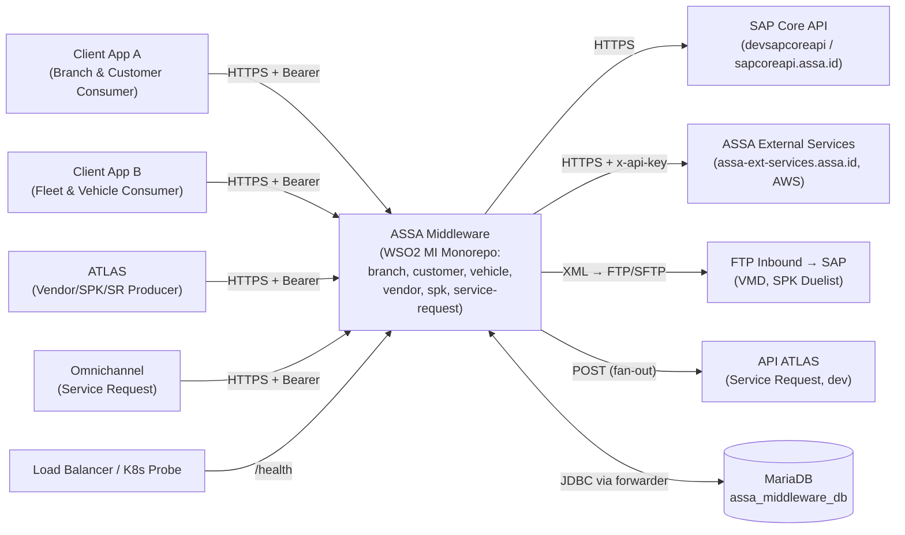
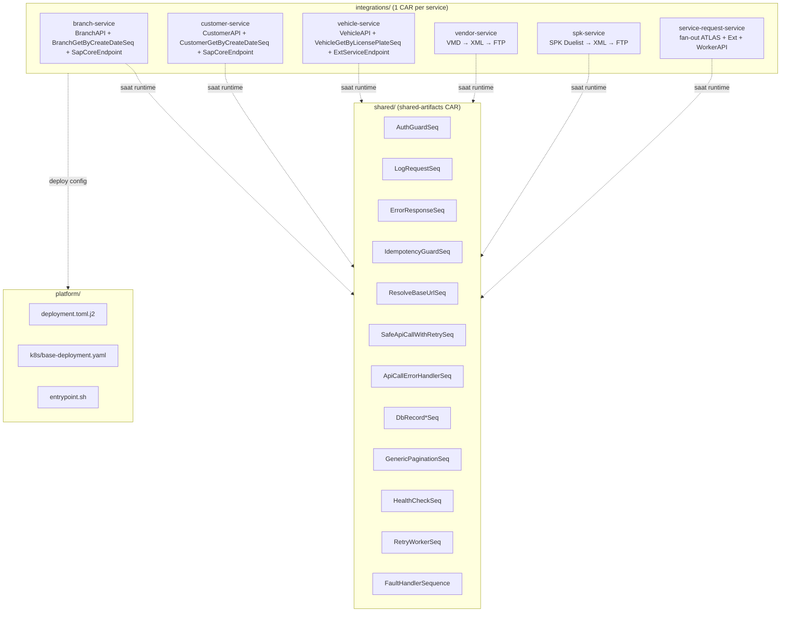
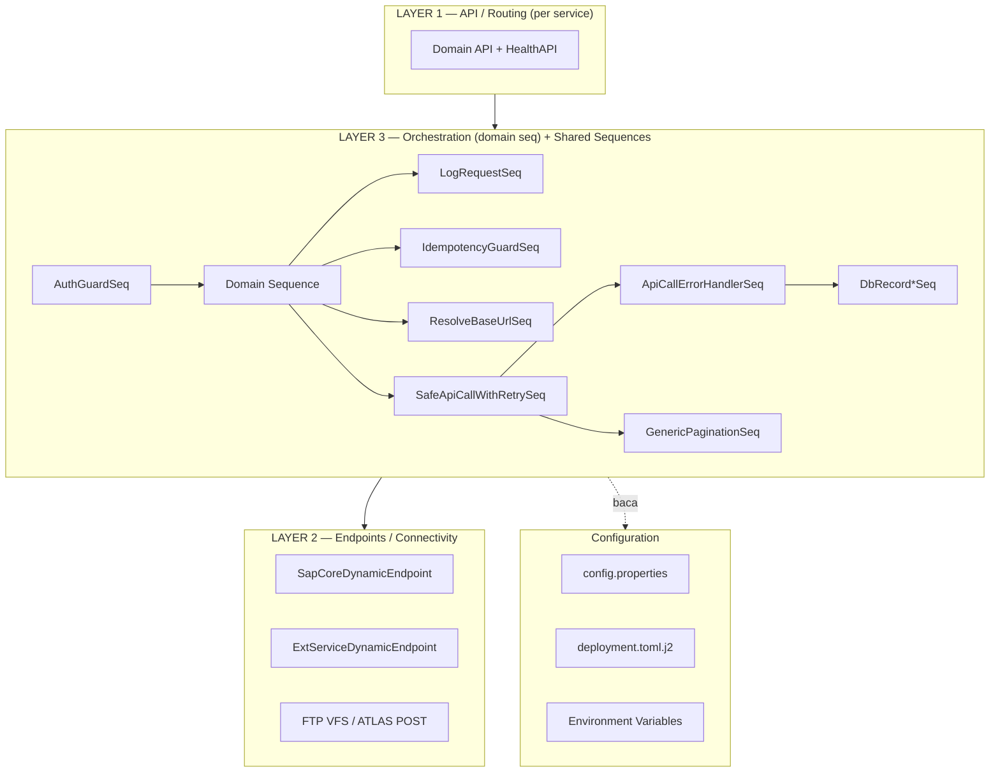
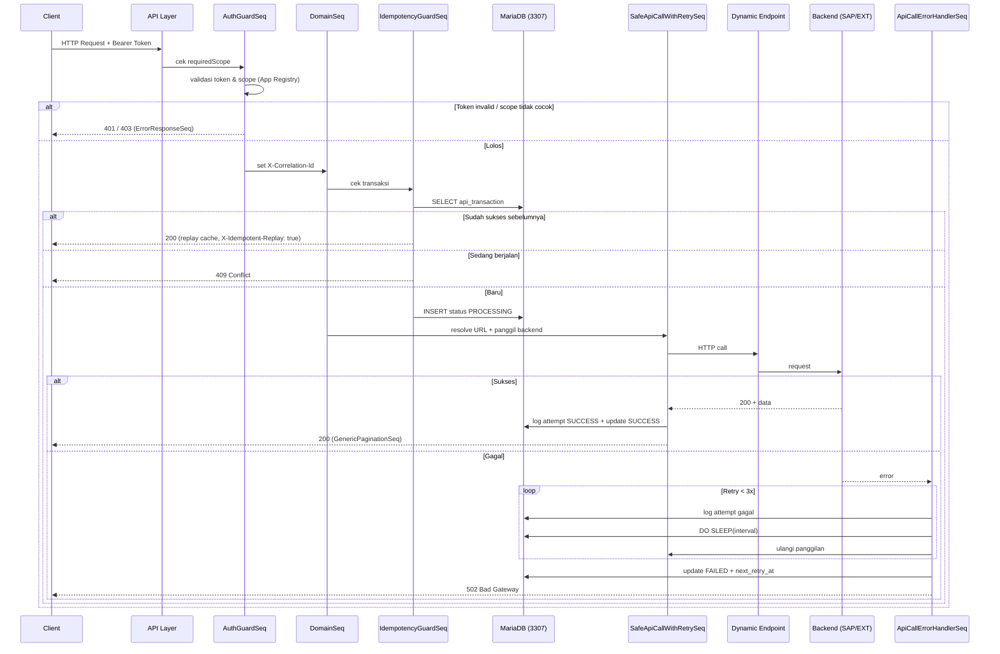
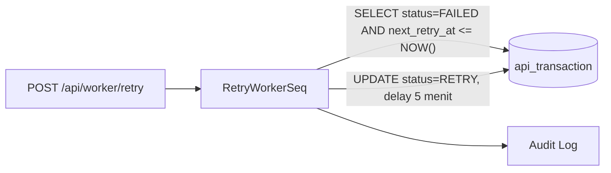
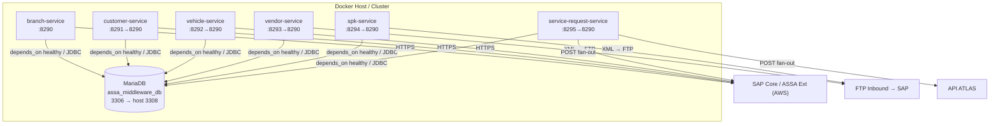
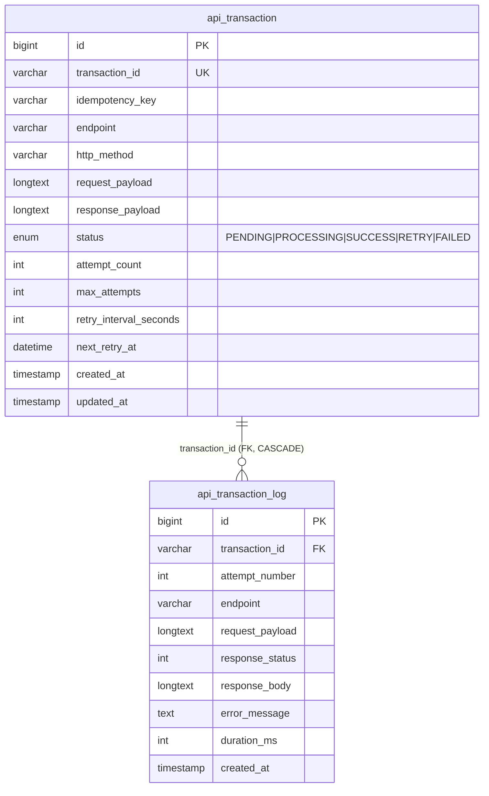
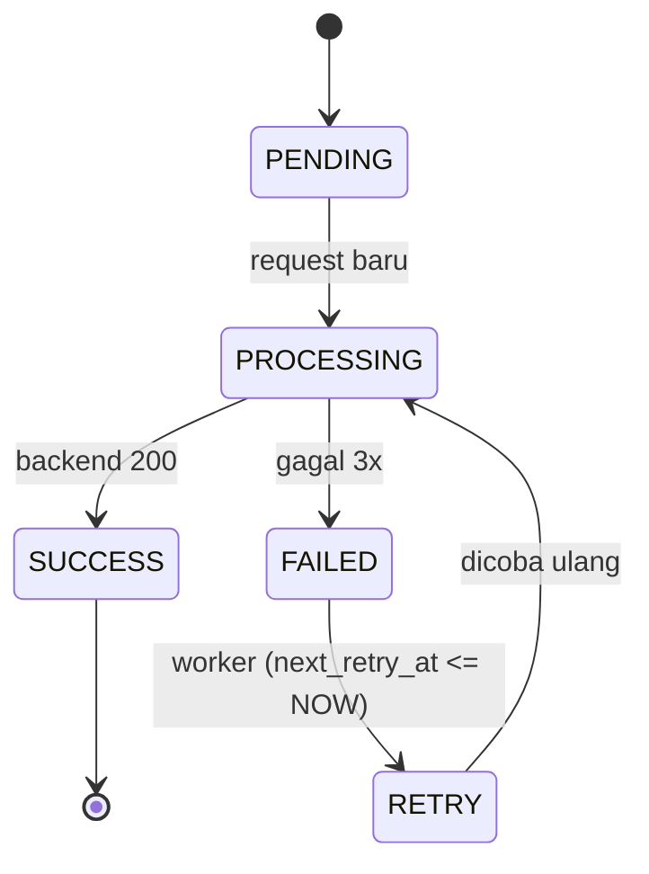

# Software Architecture Document (SAD)
## ASSA Middleware — WSO2 Micro Integrator Integration Platform

> **Created By**: Nobi Sumariga

| Field | Value |
|---|---|
| **Nama Proyek** | ASSA Middleware (`wso2-mi-monorepo`) |
| **Versi Dokumen** | 2.0.0 |
| **Tanggal** | 17 September 2026 |
| **Platform Runtime** | WSO2 Micro Integrator 4.6.0 |
| **Bahasa/Framework** | Apache Synapse (XML), Maven (multi-module), MariaDB |
| **Arsitektur Repo** | Monorepo multi-service (shared artifacts + integration services) |
| **Status** | Aktif / Production-oriented |

> **Catatan v2.0.0**: Dokumen ini diperbarui setelah restrukturisasi dari single-project `middleware-assa` menjadi **monorepo multi-service `wso2-mi-monorepo`**. Setiap domain integrasi kini menjadi service terpisah (CAR & image sendiri), dengan sequence lintas-domain dipusatkan di modul `shared/`.

---

## Daftar Isi

1. [Pendahuluan](#1-pendahuluan)
2. [Representasi Arsitektur](#2-representasi-arsitektur)
3. [Tujuan & Batasan Arsitektur](#3-tujuan--batasan-arsitektur)
4. [Sudut Pandang Use Case (Use Case View)](#4-sudut-pandang-use-case-use-case-view)
5. [Sudut Pandang Logis (Logical View)](#5-sudut-pandang-logis-logical-view)
6. [Sudut Pandang Proses (Process View)](#6-sudut-pandang-proses-process-view)
7. [Sudut Pandang Deployment (Deployment View)](#7-sudut-pandang-deployment-deployment-view)
8. [Sudut Pandang Data (Data View)](#8-sudut-pandang-data-data-view)
9. [Ukuran & Kinerja (Size & Performance)](#9-ukuran--kinerja-size--performance)
10. [Kualitas Arsitektur (Quality Attributes)](#10-kualitas-arsitektur-quality-attributes)
11. [Keputusan Arsitektur (Architecture Decisions)](#11-keputusan-arsitektur-architecture-decisions)
12. [Risiko & Rekomendasi](#12-risiko--rekomendasi)
13. [Lampiran](#13-lampiran)

---

## 1. Pendahuluan

### 1.1 Tujuan
Dokumen ini menyediakan gambaran arsitektur menyeluruh dari sistem **ASSA Middleware**. Dokumen menggunakan beberapa sudut pandang (view) untuk menggambarkan aspek-aspek berbeda dari sistem, dan ditujukan untuk arsitek, engineer, dan tim operasional yang terlibat dalam pengembangan serta pemeliharaan platform integrasi.

### 1.2 Ruang Lingkup
ASSA Middleware adalah lapisan integrasi (integration/mediation layer) berbasis WSO2 Micro Integrator (MI) yang menjembatani aplikasi konsumen (client apps: Client App A/B, QA, ATLAS, Omnichannel) dengan sistem backend perusahaan, yaitu **SAP Core API**, **ASSA External Services (AWS)**, dan **SAP via file interface (FTP)**. Middleware bertanggung jawab atas otentikasi/otorisasi, idempotency, resiliensi (retry), logging terstruktur, pencatatan transaksi ke database, pembentukan file XML (untuk interface berbasis file), serta fan-out paralel ke beberapa backend.

Repositori diorganisir sebagai **monorepo multi-service**: satu build Maven menghasilkan beberapa artefak CAR — satu CAR bersama (`shared`) dan satu CAR per service integrasi (branch, customer, vehicle, vendor, spk, service-request).

### 1.3 Definisi & Akronim

| Istilah | Penjelasan |
|---|---|
| **MI** | WSO2 Micro Integrator |
| **Synapse** | Mesin mediasi (mediation engine) berbasis XML yang dipakai MI |
| **CAR** | Carbon Application Archive (`.car`), paket deployment artefak Synapse |
| **API** | Artefak Synapse pendefinisi routing REST (pintu masuk) |
| **Sequence** | Rangkaian mediator (langkah kerja) yang dieksekusi berurutan |
| **Endpoint** | Definisi koneksi keluar menuju backend eksternal |
| **Idempotency** | Jaminan bahwa request berulang tidak menyebabkan efek ganda |
| **Scope** | Cakupan izin akses per-aplikasi (branches, customers, vehicles, vendors, spk, service_requests) |
| **Monorepo** | Satu repositori berisi banyak service yang di-build bersama (Maven multi-module) |
| **Shared CAR** | Artefak `shared-artifacts_1.0.0.car` berisi sequence reusable, dideploy bersama tiap service |
| **VFS** | Virtual File System transport WSO2 (untuk menulis file ke FTP) |

### 1.4 Referensi
- `docs/STRUKTUR_ARSITEKTUR_LENGKAP.md` — panduan struktur & alur file
- Root `pom.xml` (parent/aggregator), `shared/pom.xml`, `integrations/<service>/pom.xml`
- `platform/docker/deployment.toml.j2` (template config), `integrations/<service>/src/main/wso2mi/resources/conf/config.properties`
- `scripts/db/init_mariadb_schema.sql` — skema database
- `docker-compose.yml`, `integrations/<service>/Dockerfile` — konfigurasi deployment
- `platform/k8s/base-deployment.yaml` — base manifest K8s
- `.github/workflows/deploy-integrations.yml` — CI/CD
- `docs/GUIDE_DOCKER_KUBERNETES.md`, `docs/GUIDE_VENDOR_CREATE_XML_FTP_V2.md`, `docs/GUIDE_SPK_DUELIST_XML_FTP_V2.md`, `docs/GUIDE_SR.md`

---

## 2. Representasi Arsitektur

Arsitektur ASSA Middleware mengikuti **layered mediation architecture** dengan pola *API Gateway / Proxy* di atas WSO2 Micro Integrator. Arsitektur direpresentasikan menggunakan variasi model **4+1 View** (Logical, Process, Deployment, Data, dan Use Case).

Prinsip utama:
- **Separation of concerns per layer**: Routing (API) → Security → Orchestration → Connectivity (Endpoint).
- **Service per domain (monorepo)**: tiap domain menjadi service mandiri dengan CAR & image sendiri, dapat di-deploy & di-scale terpisah.
- **Shared reusable artifacts**: logika lintas-domain (auth, logging, idempotency, retry, DB) dipusatkan di `shared/` dan di-resolve saat runtime via `<sequence key="..."/>`.
- **No hardcoding**: Semua URL, path, kredensial, dan kebijakan retry berada di `config.properties` / `deployment.toml(.j2)` / environment variable.
- **Resilience by default**: Setiap panggilan backend otomatis memiliki retry 3x, pencatatan transaksi, dan antrean worker asinkron.
- **File & fan-out interface**: mendukung interface berbasis file (XML → FTP) dan fan-out paralel ke beberapa backend (Clone/Aggregate).

### 2.1 Diagram Konteks Sistem



---

## 3. Tujuan & Batasan Arsitektur

### 3.1 Tujuan Arsitektur
- Menyediakan **single entry point** yang aman untuk seluruh integrasi backend ASSA.
- Menjamin **ketahanan (resiliency)** terhadap kegagalan backend melalui retry dan antrean asinkron.
- Menjamin **idempotency** transaksi untuk mencegah efek ganda.
- Menyediakan **observability** melalui logging terstruktur (JSON) dan audit trail di database.
- Menghilangkan **hardcoding** konfigurasi untuk mendukung portabilitas antar-environment (dev/qa/prod).

### 3.2 Batasan Teknis (Constraints)

| Batasan | Keterangan |
|---|---|
| Runtime | WSO2 Micro Integrator 4.6.0; logika ditulis dalam Synapse XML |
| Java | Compiler target Java 1.8 (build image memakai JDK 11/17) |
| Database | MariaDB (driver `mariadb-java-client:3.3.3`), port lokal 3307 / container 3306 |
| Build | Maven multi-module (parent aggregator → `shared` + 6 service), tiap module menghasilkan `.car` |
| Port | HTTP `8290`, HTTPS `8253`, Management API `9164` (per service) |
| Transport | HTTP/HTTPS pass-through; VFS (FTP/SFTP) untuk vendor & spk |
| Deployment | Docker (multi-stage per service), Docker Compose, Kubernetes |

---

## 4. Sudut Pandang Use Case (Use Case View)

### 4.1 Aktor
- **Client App A** — mengonsumsi data Branch, Customer, dan Vehicle (scope: `branches, customers, vehicles`).
- **Client App B** — mengonsumsi data Vehicle/Fleet (scope: `vehicles`).
- **ATLAS** — producer untuk Vendor Master Data (VMD), SPK Duelist, dan Service Request.
- **Omnichannel** — consumer Service Request (fan-out).
- **QA Automation** — pengujian otomatis (scope penuh).
- **Load Balancer / Kubernetes** — melakukan health probe (tanpa token).
- **Operator/Scheduler** — memicu background retry worker.

### 4.2 Use Case Utama

| ID | Use Case | Service | Endpoint | Scope |
|---|---|---|---|---|
| UC-01 | Get Branch by Create Date | branch-service | `GET /api/branches/getByCreateDate` | branches |
| UC-02 | Get Customer by Create Date | customer-service | `GET /api/customers/getByCreateDate` | customers |
| UC-03 | Get Vehicle by License Plate | vehicle-service | `GET /api/vehicles/getByLicensePlate` | vehicles |
| UC-04 | Create Vendor (VMD → XML → FTP) | vendor-service | `POST /api/vendors/create` | vendors |
| UC-05 | Create SPK Duelist (→ XML → FTP) | spk-service | `POST /api/spk/duelist` | spk |
| UC-06 | Service Request fan-out (ATLAS + Ext) | service-request-service | `POST /api/service-requests` | service_requests |
| UC-07 | Health Liveness/Readiness | semua service | `GET /health/<service>`, `/readiness/<service>` | (tanpa token) |
| UC-08 | Trigger Retry Worker | service-request-service | `POST /api/worker/retry` | operasional |

> UC-04, UC-05, UC-06 mengikuti spesifikasi pada guide di `docs/` dan saat ini berupa kerangka service (Health + config) yang siap diimplementasi.

---

## 5. Sudut Pandang Logis (Logical View)

Arsitektur logis terdiri dari **modul `shared`** (sequence reusable) dan **6 service integrasi**, masing-masing dengan 3 layer artefak Synapse (API → Orchestration → Endpoint) ditambah lapisan konfigurasi.

### 5.1 Struktur Monorepo (Module View)



### 5.2 Layer per Service (contoh alur)



### 5.3 Komponen Kunci

| Komponen | Tanggung Jawab |
|---|---|
| **shared/** (`shared-artifacts` CAR) | Kumpulan sequence reusable; dideploy bersama tiap service, dirujuk via `<sequence key/>` saat runtime. |
| **API Layer** (`<service>/src/main/wso2mi/artifacts/apis/`) | Routing REST, penentuan `requiredScope`, delegasi ke sequence. |
| **AuthGuardSeq** | Validasi Bearer token vs App Registry, cek scope, tetapkan `X-Correlation-Id`. Menolak 401/403. |
| **IdempotencyGuardSeq** | Cek `api_transaction`; replay cache untuk sukses sebelumnya, 409 untuk in-flight, buat baris `PROCESSING` untuk baru. |
| **ResolveBaseUrlSeq** | Resolusi base URL 4-layer (header override → env → deployment.toml → config.properties → fallback). |
| **SafeApiCallWithRetrySeq** | Panggilan HTTP ke endpoint, ukur `durationMs`, catat sukses, teruskan ke pagination. |
| **ApiCallErrorHandlerSeq** | Penanganan error, retry hingga 3x dengan jeda (`DO SLEEP`), update `FAILED`, jadwalkan `next_retry_at`, kembalikan 502. |
| **DbRecordAttemptLogSeq / DbRecordTransactionSeq** | Mediator SQL untuk `api_transaction_log` dan `api_transaction`. |
| **RetryWorkerSeq** | Worker asinkron memproses transaksi `FAILED` yang jatuh tempo. |
| **GenericPaginationSeq** | Format respons standar korporat (count, data, pagination). |
| **ErrorResponseSeq** | Format error seragam JSON (401/403/502). |
| **LogRequestSeq** | Access log terstruktur JSON. |
| **Endpoints** | `SapCoreDynamicEndpoint` & `ExtServiceDynamicEndpoint` sebagai pintu keluar dinamis (tanpa hardcode URL). |

---

## 6. Sudut Pandang Proses (Process View)

### 6.1 Alur Request End-to-End (Happy Path & Error Path)



### 6.2 Proses Asinkron — Retry Worker



---

## 7. Sudut Pandang Deployment (Deployment View)

### 7.1 Topologi Deployment (Docker Compose — multi-service)

Setiap service adalah container terpisah (image sendiri), berbagi satu MariaDB. Tiap image memuat CAR service + `shared-artifacts` CAR + driver JDBC.



### 7.2 Konfigurasi Port

| Service | Port kontainer | Port host (compose) |
|---|---|---|
| branch-service | 8290 | 8290 |
| customer-service | 8290 | 8291 |
| vehicle-service | 8290 | 8292 |
| vendor-service | 8290 | 8293 |
| spk-service | 8290 | 8294 |
| service-request-service | 8290 | 8295 |
| (semua) HTTPS / Management | 8253 / 9164 | — |
| MariaDB | 3306 | 3308 |

> Di dalam kontainer, `entrypoint.sh` mem-forward `127.0.0.1:3307 → ${DB_HOST}:${DB_PORT}` sehingga `config.properties`/`deployment.toml` tetap menunjuk `localhost:3307`.

### 7.3 Artefak Build & Deploy
- Build Maven multi-module menghasilkan `shared/target/shared-artifacts_1.0.0.car` + `integrations/<service>/target/<service>_1.0.0.car` (7 CAR total). **Build terverifikasi sukses** (`mvn clean install`).
- Driver JDBC diunduh ke `integrations/<service>/deployment/libs/` oleh `maven-dependency-plugin`.
- Dockerfile **multi-stage** per service (build `.car` dengan Maven → bungkus ke `wso2/wso2mi:4.6.0`), menyalin CAR service + shared CAR + driver JAR + `entrypoint.sh`.
- CI/CD (`.github/workflows/deploy-integrations.yml`): job build → docker (matrix push 6 image) → deploy opsional ke K8s.

### 7.4 Konfigurasi Environment
Base URL & koneksi DB dapat di-override melalui environment variable (`SAP_CORE_BASE_URL`, `SAP_CORE_CUSTOMER_BASE_URL`, `ASSA_EXT_BASE_URL`, `DB_HOST`, `DB_PORT`), mendukung resolusi 4-layer di `ResolveBaseUrlSeq`. Base config template: `platform/docker/deployment.toml.j2`. Deploy K8s memakai `platform/k8s/base-deployment.yaml` (lihat `docs/GUIDE_DOCKER_KUBERNETES.md` untuk ConfigMap/Secret/Ingress/HPA/egress).

---

## 8. Sudut Pandang Data (Data View)

### 8.1 Database
Database `assa_middleware_db` (MariaDB, charset `utf8mb4`) menyimpan status transaksi dan audit trail per-attempt.

### 8.2 Model Data



### 8.3 Siklus Status Transaksi



### 8.4 Indeks Kunci
- `uq_transaction_id` — unik untuk idempotency.
- `idx_status_next_retry` — mempercepat polling worker.
- `idx_idempotency` — pencarian berdasarkan idempotency key.

---

## 9. Ukuran & Kinerja (Size & Performance)

- **Retry policy**: maksimum 3 percobaan, interval default 60 detik (dapat di-override via header `X-Retry-Interval-Seconds`).
- **Jeda retry** dieksekusi native di MariaDB via `DO SLEEP(?)`.
- **Worker asinkron**: interval polling default 120 detik (`retry.worker.interval.seconds`), penundaan RETRY 5 menit.
- **Pagination**: default `page=1`, `perPage=10`.
- **Durasi eksekusi** dicatat per attempt (`duration_ms`) untuk analisis kinerja.

---

## 10. Kualitas Arsitektur (Quality Attributes)

| Atribut | Cara Pemenuhan |
|---|---|
| **Keamanan** | Bearer token per-aplikasi + scope guard (`AuthGuardSeq`), health endpoint tanpa token, TLS via HTTPS listener. |
| **Ketahanan (Resiliency)** | Retry otomatis 3x, error handler terpusat, antrean worker asinkron untuk transaksi gagal. |
| **Idempotency** | Deteksi replay & in-flight via `api_transaction` (409 Conflict, replay cache). |
| **Observability** | Access log JSON terstruktur, `X-Correlation-Id` end-to-end, audit trail per attempt di DB. |
| **Portabilitas** | Resolusi base URL 4-layer tanpa hardcode; override via env var. |
| **Maintainability** | Reusable sequences; SOP penambahan API baru tanpa membuat endpoint baru. |
| **Konsistensi** | Format respons standar (`GenericPaginationSeq`) & error seragam (`ErrorResponseSeq`). |

---

## 11. Keputusan Arsitektur (Architecture Decisions)

| ID | Keputusan | Alasan |
|---|---|---|
| AD-01 | Gunakan WSO2 MI + Synapse XML | Mesin mediasi ringan, mendukung pola integrasi enterprise tanpa kode aplikatif kustom. |
| AD-02 | Dynamic Endpoint (URL template `{+uri.var...}`) | Menghindari hardcode & double-encoding pada query string. |
| AD-03 | Idempotency berbasis DB, bukan cache in-memory | Tahan restart, konsisten lintas node. |
| AD-04 | Retry sleep via MariaDB `DO SLEEP` | Menghindari thread-blocking mediator di MI dan memanfaatkan resource DB. |
| AD-05 | Konfigurasi terpusat (`config.properties` + `deployment.toml.j2`) | Single source of truth; mudah dipindah antar environment. |
| AD-06 | App Registry token per-aplikasi + scope | Otorisasi granular per konsumen. |
| AD-07 | Monorepo multi-service (Maven multi-module) | Domain di-deploy & di-scale terpisah, build/CI terpusat, reuse `shared` konsisten. |
| AD-08 | `shared` di-resolve saat runtime (bukan Maven dependency `car`) | WSO2 me-resolve `<sequence key/>` di server; CAR-as-dependency antar-module tidak resolvable. Shared CAR ikut dideploy per image. |
| AD-09 | Interface berbasis file (XML → FTP via VFS) untuk vendor & spk | Mengikuti kontrak ATLAS/SAP (`Transaction` header `Key2=VMD/SPK`) yang berbasis file. |
| AD-10 | Fan-out paralel (Clone/Aggregate) untuk Service Request | Satu request Omnichannel diteruskan serentak ke ATLAS & ASSA Ext Services. |

---

## 12. Risiko & Rekomendasi

> Bagian ini berisi temuan yang perlu ditindaklanjuti tim.

- **Kredensial tersimpan plaintext**: `config.properties` memuat token & API key dalam bentuk teks biasa, dan `deployment.toml(.j2)` memakai `db.password` kosong. **Rekomendasi**: gunakan WSO2 Secure Vault / cipher tool dan secret dari environment/K8s Secret, jangan commit kredensial nyata. (Diperkuat: guide K8s sudah memakai Secret untuk `DB_PASSWORD`/API key.)
- **`shared` config duplikatif**: `config.properties` disalin ke setiap service. **Rekomendasi**: pertimbangkan config terpusat (ConfigMap/env atau registry resource) agar tidak divergen antar service.
- **CAR-as-dependency dihindari**: shared tidak bisa jadi Maven dependency `car`. **Mitigasi (sudah diterapkan)**: shared CAR ikut dideploy per image; pastikan urutan deploy (shared tersedia) di server/K8s.
- **Service kerangka**: `vendor`, `spk`, `service-request` baru berisi Health + config. **Rekomendasi**: implementasi API/sequence mengikuti guide `docs/` sebelum go-live.
- **Versi runtime konsisten**: seluruh service kini memakai `wso2/wso2mi:4.6.0` (sebelumnya sempat mismatch 4.2.0). Pertahankan konsistensi di parent `pom.xml`.
- **DB password kosong**: kredensial root tanpa password tidak disarankan untuk non-lokal. **Rekomendasi**: gunakan user & password khusus dengan hak terbatas.
- **Egress backend**: untuk K8s, utamakan private networking + NetworkPolicy allowlist ke domain `.assa.id` (lihat `docs/GUIDE_DOCKER_KUBERNETES.md` §12).

---

## 13. Lampiran

### 13.1 Struktur Direktori (Monorepo)

```text
wso2-mi-monorepo/
├── .github/workflows/deploy-integrations.yml   # CI/CD
├── pom.xml                                      # Parent/aggregator POM
├── docker-compose.yml                           # Jalankan semua service (lokal)
├── shared/                                      # shared-artifacts CAR
│   ├── pom.xml
│   ├── connectors/
│   └── src/main/wso2mi/artifacts/sequences/     # Auth, Log, Error, Idempotency,
│                                                # ResolveBaseUrl, SafeApiCall, ErrorHandler,
│                                                # DbRecord*, Pagination, HealthCheck,
│                                                # RetryWorker, FaultHandlerSequence
├── integrations/                                # 1 service = 1 CAR + Dockerfile + pom.xml
│   ├── branch-service/    (BranchAPI, BranchGetByCreateDateSeq)
│   ├── customer-service/  (CustomerAPI, CustomerGetByCreateDateSeq)
│   ├── vehicle-service/   (VehicleAPI, VehicleGetByLicensePlateSeq, ExtServiceDynamicEndpoint)
│   ├── vendor-service/    (VMD → XML → FTP) [kerangka]
│   ├── spk-service/       (SPK Duelist → XML → FTP) [kerangka]
│   └── service-request-service/ (fan-out ATLAS + Ext, WorkerAPI) [kerangka]
├── platform/
│   ├── docker/deployment.toml.j2                # Base config template
│   ├── docker/entrypoint.sh                     # DB forwarder bridge
│   └── k8s/base-deployment.yaml                 # Base K8s manifest
├── scripts/db/init_mariadb_schema.sql
└── docs/                                        # SAD, guide-guide, STRUKTUR
```

### 13.2 Endpoint Backend

| Nama | Base URL | Digunakan Oleh |
|---|---|---|
| SAP Core (dev) | `https://devsapcoreapi.assa.id` | branch-service |
| SAP Core Customer (prod) | `https://sapcoreapi.assa.id` | customer-service |
| ASSA External Services (QA/dev) | `https://assa-ext-services.assa.id/{qa,dev}` | vehicle-service, service-request-service |
| FTP Inbound → SAP | (VFS FTP/SFTP, dari config) | vendor-service, spk-service |
| API ATLAS (dev) | configurable/toggle (`sr.target.atlas.*`) | service-request-service |

### 13.3 App Registry & Scope

| App ID | Nama | Scope |
|---|---|---|
| `app_a` | Customer and Branch Service Consumer | branches, customers, vehicles, vendors |
| `app_b` | Operations and Fleet Consumer | vehicles |
| `app_qa` | QA Automation Consumer | branches, customers, vehicles, vendors |
| `app_atlas` (rencana) | ATLAS Producer | vendors, spk, service_requests |
| `app_omnichannel` (rencana) | Omnichannel SR Consumer | service_requests |

> Scope `spk` & `service_requests` ditambahkan seiring implementasi service terkait; daftarkan token app pada App Registry (`config.properties`) / Secret.

---

*Dokumen ini disusun sebagai Software Architecture Document standar untuk platform ASSA Middleware. Versi 2.0.0 menyesuaikan arsitektur monorepo multi-service. Perbarui dokumen setiap kali terjadi perubahan arsitektur signifikan.*
