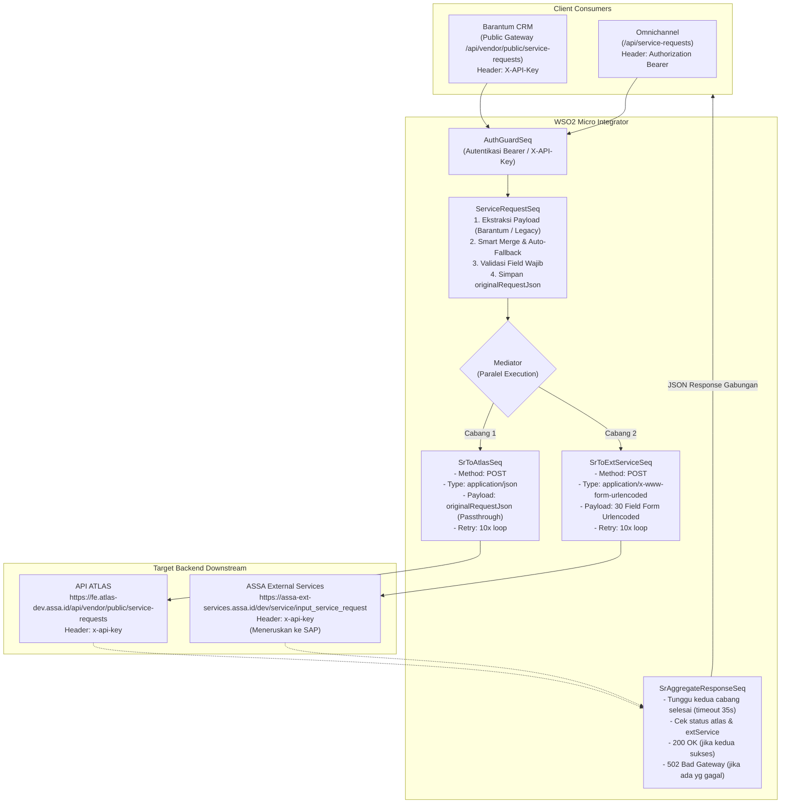

# Dokumentasi Alur & Pemetaan Field Fitur Service Request (SR) Fan-Out Paralel
## ASSA Middleware — WSO2 Micro Integrator

> **Tanggal**: 28 September 2026  
> **Status**: Verified against WSO2 MI Artifacts  
> **File Referensi Kode**:
> - API Gateway: `ServiceRequestAPI.xml` & `PublicServiceRequestAPI.xml`
> - Orchestrator: `ServiceRequestSeq.xml`
> - Target 1: `SrToAtlasSeq.xml` & `AtlasPostEndpoint.xml`
> - Target 2: `SrToExtServiceSeq.xml` & `ExtServicePostEndpoint.xml`
> - Aggregator: `SrAggregateResponseSeq.xml`

---

## 1. Arsitektur Alur Fan-Out Paralel

Ketika client (Omnichannel atau Barantum CRM) mengirim HTTP `POST` ke Middleware ASSA, middleware melakukan validasi, normalisasi data, lalu mengeksekusi pengiriman ke dua target backend secara **paralel (fan-out)** menggunakan mediator `<clone>`:



---

## 2. Input ke Middleware: Dua Format yang Didukung

Middleware mendukung 2 format JSON payload:

### A. Format Baru Barantum CRM (Nested `unit`)
```json
{
  "customerName": "PT Maju Bersama ASSA",
  "requestorName": "Ahmad Fauzi",
  "requestorPhone": "081234567890",
  "branch": "JKT01",
  "referenceNumber": "REF-SR-2026-001",
  "unit": {
    "licensePlate": "B-1234-SSA",
    "chassisNumber": "EQ-998877",
    "engineNumber": "ENG-123456",
    "brand": "Toyota",
    "model": "Avanza",
    "vehicleType": "Minibus",
    "year": "2023",
    "color": "Hitam",
    "transmisi": "Automatic",
    "cc": "1500",
    "odometer": "25000"
  }
}
```

### B. Format Legacy Omnichannel (Flat 30 Fields Snake_Case)
```json
{
  "app_id": "sr_app_omnichannel",
  "reff_number": "REF-SR-2026-001",
  "branchCode": "JKT01",
  "equipment_number": "EQ-998877",
  "license_plate": "B-1234-SSA",
  "customerCode": "CUST-00123",
  "customer_name": "PT Maju Bersama ASSA",
  "channel": "Omnichannel-Web",
  "cp_title": "Bpk",
  "cp_name": "Ahmad Fauzi",
  "cp_phone": "081234567890",
  "cp_email": "ahmad.fauzi@example.com",
  "cp_address": "Jl. Gatot Subroto No. 45 Jakarta",
  "km": "25000",
  "description": "Perawatan berkala 25.000 KM dan cek sistem rem",
  "service_datetime": "2026-09-28 10:00:00",
  "service_location": "Bengkel Resmi ASSA Sunter",
  "jenis_permintaan": "Service Berkala",
  "incident_datetime": "2026-09-25 09:00:00",
  "tipe_tiket": "Regular",
  "judul": "Service Berkala Kendaraan",
  "nama_kunjungan": "Ahmad Fauzi",
  "telepon_kunjungan": "081234567890",
  "alamat_kunjungan": "Jl. Danau Sunter Barat",
  "pool_name": "Pool Sunter",
  "area_bengkel": "Jakarta Utara",
  "task": "Ganti Oli Mesin dan Filter",
  "created_datetime": "28-09-2026",
  "created_by": "omnichannel_agent",
  "ticket_no": "TCK-SR-2026-001"
}
```

---

## 3. Matriks Pemetaan Field dari Awal Sampai Akhir

Berikut adalah pemetaan lengkap field yang diterima di awal oleh middleware, bagaimana field dinormalisasi, serta bagaimana field tersebut dikirim ke **API ATLAS** dan **ASSA External Services**:

| No | Field Input Barantum | Field Input Legacy | Property WSO2 (`$ctx`) | Field Diteruskan ke API ATLAS (`SrToAtlasSeq`) | Field Diteruskan ke ASSA Ext Service (`SrToExtServiceSeq`) | Logika Fallback / Default Value | Wajib di Awal |
|:--:|:---|:---|:---|:---|:---|:---|:--:|
| 1 | *(auto/custom)* | `app_id` | `sr_app_id` | *(sesuai raw JSON awal)* | `app_id` | Jika kosong → `"BARANTUM"` | Tidak |
| 2 | `referenceNumber` | `reff_number` | `sr_reff_number` | *(sesuai raw JSON awal)* | `reff_number` | Smart merge: `referenceNumber` jika `reff_number` kosong | **Ya (400)** |
| 3 | `branch` | `branchCode` | `sr_branch_code` | *(sesuai raw JSON awal)* | `branchCode` | Smart merge: `branch` jika `branchCode` kosong | **Ya (400)** |
| 4 | `unit.chassisNumber` | `equipment_number` | `sr_equipment_number` | *(sesuai raw JSON awal)* | `equipment_number` | Smart merge: `chassisNumber` jika `equipment_number` kosong | Tidak |
| 5 | `unit.licensePlate` | `license_plate` | `sr_license_plate` | *(sesuai raw JSON awal)* | `license_plate` | Smart merge: `licensePlate` jika `license_plate` kosong | **Ya (400)** |
| 6 | *(tidak ada)* | `customerCode` | `sr_customer_code` | *(sesuai raw JSON awal)* | `customerCode` | Kosong jika tidak diisi | Tidak |
| 7 | `customerName` | `customer_name` | `sr_customer_name` | *(sesuai raw JSON awal)* | `customer_name` | Smart merge: `customerName` jika `customer_name` kosong | **Ya (400)** |
| 8 | *(auto/custom)* | `channel` | `sr_channel` | *(sesuai raw JSON awal)* | `channel` | Jika kosong → `"Barantum"` | Tidak |
| 9 | *(auto/custom)* | `cp_title` | `sr_cp_title` | *(sesuai raw JSON awal)* | `cp_title` | Jika kosong → `"Bpk/Ibu"` | Tidak |
| 10 | `requestorName` | `cp_name` | `sr_cp_name` | *(sesuai raw JSON awal)* | `cp_name` | Smart merge: `requestorName` jika `cp_name` kosong | Tidak |
| 11 | `requestorPhone` | `cp_phone` | `sr_cp_phone` | *(sesuai raw JSON awal)* | `cp_phone` | Smart merge: `requestorPhone` jika `cp_phone` kosong | Tidak |
| 12 | *(tidak ada)* | `cp_email` | `sr_cp_email` | *(sesuai raw JSON awal)* | `cp_email` | Kosong jika tidak diisi | Tidak |
| 13 | *(tidak ada)* | `cp_address` | `sr_cp_address` | *(sesuai raw JSON awal)* | `cp_address` | Kosong jika tidak diisi | Tidak |
| 14 | `unit.odometer` | `km` | `sr_km` | *(sesuai raw JSON awal)* | `km` | Smart merge: `odometer` jika `km` kosong | Tidak |
| 15 | *(tidak ada)* | `description` | `sr_description` | *(sesuai raw JSON awal)* | `description` | Jika kosong → `"Service Request for {licensePlate} (Reff: {reff_number})"` | Tidak |
| 16 | *(tidak ada)* | `service_datetime` | `sr_service_datetime` | *(sesuai raw JSON awal)* | `service_datetime` | Jika kosong → Tanggal & jam saat ini (`yyyy-MM-dd HH:mm:ss`) | Tidak |
| 17 | *(tidak ada)* | `service_location` | `sr_service_location` | *(sesuai raw JSON awal)* | `service_location` | Jika kosong → Nilai `branchCode` | Tidak |
| 18 | *(tidak ada)* | `jenis_permintaan` | `sr_jenis_permintaan` | *(sesuai raw JSON awal)* | `jenis_permintaan` | Jika kosong → `"Service Berkala"` | Tidak |
| 19 | *(tidak ada)* | `incident_datetime` | `sr_incident_datetime` | *(sesuai raw JSON awal)* | `incident_datetime` | Kosong jika tidak diisi | Tidak |
| 20 | *(tidak ada)* | `tipe_tiket` | `sr_tipe_tiket` | *(sesuai raw JSON awal)* | `tipe_tiket` | Jika kosong → `"Regular"` | Tidak |
| 21 | *(tidak ada)* | `judul` | `sr_judul` | *(sesuai raw JSON awal)* | `judul` | Jika kosong → `"Service Request - {licensePlate}"` | Tidak |
| 22 | *(tidak ada)* | `nama_kunjungan` | `sr_nama_kunjungan` | *(sesuai raw JSON awal)* | `nama_kunjungan` | Jika kosong → Nilai `cp_name` | Tidak |
| 23 | *(tidak ada)* | `telepon_kunjungan` | `sr_telepon_kunjungan` | *(sesuai raw JSON awal)* | `telepon_kunjungan` | Jika kosong → Nilai `cp_phone` | Tidak |
| 24 | *(tidak ada)* | `alamat_kunjungan` | `sr_alamat_kunjungan` | *(sesuai raw JSON awal)* | `alamat_kunjungan` | Kosong jika tidak diisi | Tidak |
| 25 | *(tidak ada)* | `pool_name` | `sr_pool_name` | *(sesuai raw JSON awal)* | `pool_name` | Jika kosong → Nilai `branchCode` | Tidak |
| 26 | *(tidak ada)* | `area_bengkel` | `sr_area_bengkel` | *(sesuai raw JSON awal)* | `area_bengkel` | Jika kosong → Nilai `branchCode` | Tidak |
| 27 | *(tidak ada)* | `task` | `sr_task` | *(sesuai raw JSON awal)* | `task` | Jika kosong → `"Service Berkala"` | Tidak |
| 28 | *(tidak ada)* | `created_datetime` | `sr_created_datetime` | *(sesuai raw JSON awal)* | `created_datetime` | Jika kosong → Tanggal saat ini (`dd-MM-yyyy`) | Tidak |
| 29 | *(tidak ada)* | `created_by` | `sr_created_by` | *(sesuai raw JSON awal)* | `created_by` | Jika kosong → Nilai `cp_name` (atau `"Barantum"`) | Tidak |
| 30 | *(tidak ada)* | `ticket_no` | `sr_ticket_no` | *(sesuai raw JSON awal)* | `ticket_no` | Jika kosong → Nilai `reff_number` | Tidak |

---

## 4. Rincian Pengiriman ke Masing-Masing Target

### Cabang 1: Diteruskan ke API ATLAS (`SrToAtlasSeq.xml`)

API ATLAS menerima request sebagai **JSON** murni:
- **Target URL**:  
  `https://fe.atlas-dev.assa.id/api/vendor/public/service-requests`  
  *(Dapat di-override via env `SR_TARGET_ATLAS_BASE_URL` + `SR_TARGET_ATLAS_PATH`)*
- **HTTP Method**: `POST`
- **Request Headers**:
  - `Content-Type: application/json`
  - `x-api-key: <SR_TARGET_ATLAS_APIKEY>` *(jika dikonfigurasikan)*
  - *(Header `Authorization` client dihapus agar tidak bocor)*
- **Payload Format**:  
  **Raw Passthrough JSON** (`originalRequestJson`).  
  Artinya:
  - Jika client mengirimkan format baru Barantum (ada field `customerName`, nested `unit`, dll.), maka API ATLAS menerima JSON tersebut secara utuh.
  - Jika client mengirimkan format legacy 30 field, maka API ATLAS menerima JSON 30 field tersebut secara utuh.
- **Logika Retry**:
  Maksimal **10 kali percobaan** dengan jeda **1 detik** (`DO SLEEP(1)` via DB query). Jika dalam rentang HTTP 200–299 dianggap `SUCCESS`, selain itu dianggap `FAILED`.

---

### Cabang 2: Diteruskan ke ASSA External Services (`SrToExtServiceSeq.xml`)

ASSA External Services adalah backend yang memproses Service Request untuk kemudian diteruskan ke SAP:
- **Target URL**:  
  `https://assa-ext-services.assa.id/dev/service/input_service_request`  
  *(Dapat di-override via env `ASSA_EXT_SR_BASE_URL` / `assa.ext.base.url.dev` + `assa.api.path.service_request`)*
- **HTTP Method**: `POST`
- **Request Headers**:
  - `Content-Type: application/x-www-form-urlencoded`
  - `x-api-key: DDtCZNeoPN27TWpHJdk9zaFwivxXrqQs2r1hbiKs` *(atau dari env `ASSA_EXT_SR_APIKEY`)*
  - *(Header `Authorization` client dihapus)*
- **Payload Format**:  
  **30 Parameter `x-www-form-urlencoded`** persis:
  ```http
  POST /dev/service/input_service_request HTTP/1.1
  Host: assa-ext-services.assa.id
  x-api-key: DDtCZNeoPN27TWpHJdk9zaFwivxXrqQs2r1hbiKs
  Content-Type: application/x-www-form-urlencoded

  app_id=BARANTUM&reff_number=REF-SR-2026-001&branchCode=JKT01&equipment_number=EQ-998877&license_plate=B-1234-SSA&customerCode=&customer_name=PT+Maju+Bersama+ASSA&channel=Barantum&cp_title=Bpk%2FIbu&cp_name=Ahmad+Fauzi&cp_phone=081234567890&cp_email=&cp_address=&km=25000&description=Service+Request+for+B-1234-SSA+%28Reff%3A+REF-SR-2026-001%29&service_datetime=2026-09-28+15%3A30%3A00&service_location=JKT01&jenis_permintaan=Service+Berkala&incident_datetime=&tipe_tiket=Regular&judul=Service+Request+-+B-1234-SSA&nama_kunjungan=Ahmad+Fauzi&telepon_kunjungan=081234567890&alamat_kunjungan=&pool_name=JKT01&area_bengkel=JKT01&task=Service+Berkala&created_datetime=28-09-2026&created_by=Ahmad+Fauzi&ticket_no=REF-SR-2026-001
  ```
- **Logika Retry**:
  Maksimal **10 kali percobaan** dengan jeda **1 detik**. Jika status HTTP 200–299 dianggap `SUCCESS`, selain itu dianggap `FAILED`.

---

## 5. Agregasi Hasil (`SrAggregateResponseSeq.xml`)

Setelah kedua cabang selesai mengeksekusi request (atau batas timeout agregasi 35 detik tercapai), hasilnya digabung:

### Kondisi 1: Kedua Target Sukses (`200 OK`)
Jika status `atlas == 'SUCCESS'` dan status `extService == 'SUCCESS'`:
```json
{
  "success": true,
  "message": "Service request diteruskan ke semua target",
  "transactionId": "REF-SR-2026-001",
  "referenceNumber": "REF-SR-2026-001",
  "ticket_no": "REF-SR-2026-001",
  "targets": {
    "atlas": {
      "status": "SUCCESS",
      "httpStatus": 200,
      "detail": "Success forwarded to API ATLAS"
    },
    "extService": {
      "status": "SUCCESS",
      "httpStatus": 200,
      "detail": "Success forwarded to ASSA External Services"
    }
  }
}
```

### Kondisi 2: Salah Satu / Kedua Target Gagal (`502 Bad Gateway`)
Jika salah satu target gagal atau tidak merespons setelah 10 kali retry:
```json
{
  "error": true,
  "success": false,
  "message": "Service request gagal diteruskan (target gagal setelah 10x percobaan)",
  "transactionId": "REF-SR-2026-001",
  "referenceNumber": "REF-SR-2026-001",
  "ticket_no": "REF-SR-2026-001",
  "targets": {
    "atlas": {
      "status": "FAILED",
      "httpStatus": 502,
      "detail": "Forward to API ATLAS failed after 10 attempts"
    },
    "extService": {
      "status": "SUCCESS",
      "httpStatus": 200,
      "detail": "Success forwarded to ASSA External Services"
    }
  }
}
```

---

## 6. Ringkasan Singkat

1. **Client POST ke Middleware**:
   - Menerima format JSON Barantum (dengan object `unit`) atau format JSON Flat 30 fields.
   - Wajib memiliki `referenceNumber` / `reff_number`, `branch` / `branchCode`, `customerName` / `customer_name`, dan `unit.licensePlate` / `license_plate`.
2. **Diteruskan ke API ATLAS**:
   - Format: **`application/json`**.
   - Body: **JSON utuh apa adanya (`originalRequestJson`)** yang dikirim client.
3. **Diteruskan ke ASSA External Services**:
   - Format: **`application/x-www-form-urlencoded`**.
   - Body: **30 parameter flat**, dengan nilai otomatis diisi fallback default jika client tidak mengirimkannya.
4. **Respon ke Client**:
   - Mengembalikan hasil agregasi kedua target (`200 OK` jika keduanya berhasil, `502 Bad Gateway` jika salah satu/keduanya gagal).
